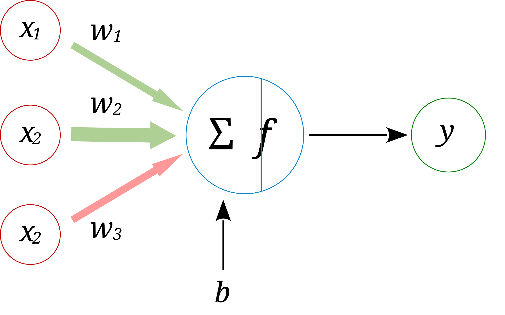

# Learning and Mathematical Preliminaries

Artificial Neural Networks

---

## The question for the semester

How can a machine improve a prediction by changing numbers?

Represent

Turn observations into numerical arrays.

Evaluate

Measure prediction error with a loss.

Update

Use derivatives to change parameters.

Lecture 1 develops the language required to answer this question precisely.

---

## Learning objectives

By the end of the lecture, students can

- Formulate a supervised learning problem using data, a model, a loss, and parameters.
- Translate between mathematical notation and PyTorch tensor operations.
- Compute dot products, matrix products, gradients, and a chain-rule derivative.
- Use autograd and verify a derivative with finite differences.
- Explain why probability and data splits matter for prediction under uncertainty.
Standard: derive it, compute it, implement it, interpret it.

---

## Rules struggle when observations vary

Possible sources of variation

- measurement noise
- timing and amplitude
- subject and environment
- task-relevant differences
Learning uses examples to determine which variation matters for the target.

---

## A learning system has four components

Data

Observed examples and, for supervised learning, targets.

Model

A parameterized mapping from input to prediction.

Objective

A loss that assigns a numerical cost to predictions.

Optimization

An algorithm that changes parameters to reduce loss.

data + model + loss + optimization = learning system

---

## An artificial neuron forms a weighted sum

Each input contributes according to its weight; the bias shifts the result.

\[z=\sum_{j=1}^{d}w_jx_j+b,\qquad \hat y=\phi(z).\]

A network composes these simple parameterized computations.

---

## Supervised learning in one line

D = {(xᵢ, yᵢ)}ᵢ₌₁ᴺ

ŷᵢ = fθ(xᵢ)

L(θ) = (1/N) Σᵢ ℓ(fθ(xᵢ), yᵢ)

θ* = arg minθ L(θ)

The model supplies predictions. The loss defines improvement. Optimization searches over parameters.

---

## Prediction tasks differ in their targets

Task

Target y

Example

Typical output

Regression

continuous value

remaining useful life

one or more real values

Binary classification

one of two classes

fault / normal

one probability or logit

Multiclass classification

one of k classes

gesture identity

k class scores

Multilabel classification

several labels

simultaneous events

k independent scores

The target determines the mathematical meaning of the output and the appropriate loss.

---

## Running case: predicting force from EMG

Observation

x ∈ Rᵈ

A window of samples from multiple EMG channels

Model

ŷ = fθ(x)

A differentiable mapping with trainable parameters

Target

y ∈ R

Measured force for the same time window

ℓ(ŷ,y) = (ŷ − y)²

Question: what information may leak if neighboring windows enter both training and test sets?

---

## Numerical arrays connect data to computation

Raw observations

time,ch1,ch2,force

0.00,0.12,-0.03,14.1

0.01,0.16,-0.01,14.4

0.02,0.09, 0.02,13.9

Feature matrix

X = [0.12 −0.03

0.16 −0.01

0.09 0.02]

Tensor

X.shape

# [3, 2]

X.dtype

# float32

Rows represent examples or time samples. Columns represent measured variables or features.

---

## Scalars, vectors, matrices, and tensors

Object

Notation

Order

Example shape

Interpretation

Scalar

x

[]

one value

Vector

x

[d]

one example with d features

Matrix

X

[N,d]

N examples with d features

Tensor

X

3 or more

[B,C,T]

batch, channels, time

Tensor order and tensor dimension are related ideas, but shape communicates the exact size of every axis.

---

## Every tensor axis must have a meaning

X has shape [B, C, T]

B

batch size

number of examples processed together

C

channels

number of simultaneous sensors

T

time

number of samples in each window

Example: X.shape = [32, 8, 256] contains 32 windows, 8 channels, and 256 samples per channel.

---

## The same object in mathematics and PyTorch

X = [0 1 2

3 4 5] ∈ R²ˣ³

import torch

X = torch.arange(6, dtype=torch.float32)

X = X.reshape(2, 3)

print(X)

print(X.shape, X.numel())

Expected

tensor([[0., 1., 2.],

[3., 4., 5.]])

torch.Size([2, 3]) 6

reshape changes the view of the values, not their number.

---

## Indexing and reductions preserve axis logic

X = torch.tensor([[1., 2., 3.],

[4., 5., 6.]])

X[0, 1] # tensor(2.)

X[:, 1] # tensor([2., 5.])

X.sum() # tensor(21.)

X.sum(dim=0) # tensor([5., 7., 9.])

X.mean(dim=1) # tensor([2., 5.])

Questions

- Which axis disappears after each reduction?
- What does dim=0 mean in this matrix?
- When should keepdim=True be used?
sum over rows ⇒ one value per column

Never memorize dim numbers without naming the axes.

---

## Broadcasting applies one vector across a batch

X = [1 2

3 4

5 6]

+

b = [10 20]

=

[11 22

13 24

15 26]

X = torch.tensor([[1.,2.],[3.,4.],[5.,6.]])

b = torch.tensor([10.,20.])

Y = X + b # shape [3,2]

Compatible trailing dimensions allow b to act as one bias vector shared by all rows.

---

## Preprocessing decisions become model assumptions

Raw data

missing values

mixed units

categorical fields

outliers

sensor faults

Decisions

impute or remove

scale using training data

encode categories

filter or flag

record the pipeline

Tensor

X ∈ Rᴺˣᵈ

y ∈ Rᴺ

Fit every data-dependent transformation on the training set only.

Otherwise, information from validation or test data leaks into model development.

---

## Tensors carry both values and structure

- State the shape and axis meaning of a batch of 16 windows with 4 channels and 200 samples.
- Predict the result shape of X.sum(dim=2).
- Explain one way preprocessing can leak test information.

---

## The dot product is a weighted sum

x = [2, −1, 3]ᵀ w = [0.5, 2, −1]ᵀ

wᵀx = Σⱼ wⱼxⱼ

= 0.5(2) + 2(−1) + (−1)(3) = −4

x = torch.tensor([2., -1., 3.])

w = torch.tensor([0.5, 2., -1.])

torch.dot(w, x) # tensor(-4.)

---

## Matrix multiplication computes many weighted sums

A ∈ Rᵐˣᵈ, x ∈ Rᵈ ⇒ Ax ∈ Rᵐ

Each row of A forms one dot product with x.

A ∈ Rᵐˣᵈ, B ∈ Rᵈˣᵏ ⇒ AB ∈ Rᵐˣᵏ

Inner dimensions agree. Outer dimensions remain.

y = A @ x

C = A @ B

---

## Worked matrix product

A = [1 2

3 4]

B = [2 0

1 −1]

Entry

Dot product

Value

C₁₁

[1,2] · [2,1]

C₁₂

[1,2] · [0,−1]

−2

C₂₁

[3,4] · [2,1]

C₂₂

[3,4] · [0,−1]

−4

AB = [ 4 −2

10 −4]

A @ B

---

## Norms quantify size

‖x‖₁ = Σᵢ |xᵢ

‖x‖₂ = √(Σᵢ xᵢ²)

‖A‖F = √(ΣᵢΣⱼ Aᵢⱼ²)

For x = [3, −4]ᵀ

‖x‖₁ = 7

‖x‖₂ = 5

torch.linalg.vector_norm(x, ord=1)

torch.linalg.vector_norm(x, ord=2)

---

## A derivative measures local sensitivity

L(w) = (w−3)²

dL/dw = 2(w−3)

At w = 1:

dL/dw = −4

Increasing w slightly should reduce the loss.

---

## A gradient collects all partial derivatives

L(w,b) = (wx + b − y)²

∇L = [∂L/∂w, ∂L/∂b]ᵀ

∂L/∂w = 2(wx+b−y)x

∂L/∂b = 2(wx+b−y)

The gradient points in the direction of greatest local increase. Gradient descent moves in the opposite direction.

---

## The chain rule follows dependence through a graph

w

z = wx+b

ŷ = g(z)

L = ℓ(ŷ,y)

dL/dw = (∂L/∂ŷ)(dŷ/dz)(∂z/∂w)

Backpropagation evaluates these local derivatives from right to left.

---

## PyTorch records the graph and computes the gradient

import torch

x = torch.tensor(2.0)

y = torch.tensor(5.0)

w = torch.tensor(1.0, requires_grad=True)

b = torch.tensor(0.0, requires_grad=True)

y_hat = w*x + b

loss = (y_hat - y)**2

loss.backward()

print(loss.item()) # 9.0

print(w.grad) # -12.0

print(b.grad) # -6.0

Manual check

∂L/∂w

= 2(wx+b−y)x

= 2(2−5)(2)

= −12

Autograd replaces repetitive differentiation, not mathematical understanding.

---

## Finite differences test an analytical gradient

dL/dw ≈ [L(w+h) − L(w)] / h

def loss(w):

return (2*w - 5)**2

h = 1e-4

g = (loss(1+h)-loss(1))/h

print(g) # about -12

Forward differences provide an independent diagnostic for implementation errors.

---

## Probability is the language of uncertain prediction

Outcome

A value that may occur

Example: gesture class y

Random variable

A numerical mapping of outcomes

Example: force Y

Distribution

Probabilities assigned to possible values

Example: P(Y | X=x)

P(y | x) quantifies uncertainty about the target after observing x

A prediction may report a value, a class, or an entire conditional distribution.

---

## Empirical frequency stabilizes with more observations

P̂(A) = count(A) / n

With more observations, empirical frequency often approaches the underlying probability.

rolls = torch.randint(1, 7, (200,))

freq = (rolls == 1).float().cumsum(0)

freq /= torch.arange(1, 201)

---

## Expectation and variance summarize a distribution

E[X] = Σₓ x p(x)

Var(X) = E[(X − E[X])²]

Fair six-sided die

E[X] = (1+2+3+4+5+6)/6 = 3.5

Expectation is a probability-weighted average. Variance measures squared deviation around that average.

Training losses are usually empirical averages that estimate an expected loss.

---

## Training, validation, and test splits

Split

Used to

Must not be used to

Training

fit parameters

claim final generalization

Validation

select models and hyperparameters

update weights directly

Test

estimate final performance once

choose preprocessing or architecture

For subject-dependent measurements, split by subject or acquisition session before forming windows.

The split must represent the deployment question.

---

## The mathematical skeleton of supervised learning

D = {(xᵢ,yᵢ)}ᵢ₌₁ᴺ

ŷᵢ = fθ(xᵢ)

ℓᵢ = ℓ(ŷᵢ,yᵢ)

L(θ) = (1/N) Σᵢ ℓᵢ

g = ∇θ L(θ)

θ ← θ − ηg

Data supplies evidence. Calculus supplies a local direction. Code carries out the update.

---

## One complete PyTorch gradient update

import torch

x = torch.tensor([1., 2., 3.])

y = 2*x + 1

w = torch.tensor(0., requires_grad=True)

b = torch.tensor(0., requires_grad=True)

y_hat = w*x + b

loss = ((y_hat - y)**2).mean()

loss.backward()

with torch.no_grad():

w -= 0.1*w.grad

b -= 0.1*b.grad

Before update

w = 0, b = 0

L = 27.667

Gradient

∂L/∂w = −22.667

∂L/∂b = −10

After update: w ≈ 2.267, b = 1

---

## The update changes predictions and loss

Quantity

Before

After one step

w

0.000

2.267

b

0.000

1.000

predictions

[0, 0, 0]

[3.267, 5.533, 7.800]

mean squared loss

27.667

0.332

A large improvement on three training points does not yet demonstrate generalization.

---

## Lecture 1 synthesis

Five ideas to retain

- A learning system connects data, a parameterized model, a loss, and an optimization rule.
- Tensor shapes encode the structure of examples and operations.
- Linear algebra computes predictions efficiently across many examples.
- Calculus describes how the loss responds to parameter changes.
- Autograd evaluates derivatives, but independent checks remain valuable.
