# Generalization and Regularization

Artificial Neural Networks

---

## Learning objectives

Learning objectives

Read training and validation evidence.

Derive and implement an L2-regularized update.

Choose a split that matches the intended use.

Report a baseline, variability, and the limits of a claim.

---

## From model fitting to scientific evidence

From training code to scientific evidence

Define

→

Fit

→

Check code

→

Evaluate claim

Lecture 1: data → prediction → loss → gradient → update

Lecture 2: repeat the updates; implement and check

Lecture 3: evaluate the claim on appropriate new data

---

## Model selection by training error

Candidate A

Training residuals: 0, 0, 0 Validation residuals: 2, −2

Candidate B

Training residuals: 0.5, −0.5, 0 Validation residuals: 0.5, −0.5

Find all four MSEs. Which candidate should proceed?

---

## Validation can reverse the ranking

A: training MSE = 0 validation MSE = 4

B: training MSE = 1/6 validation MSE = 0.25

Choose B using validation. A final test estimate is still missing.

---

## Training error and population risk

Training loss and population risk

• The fitted sample is available. The target population must be named.

• A representative, independent test set estimates risk with uncertainty.

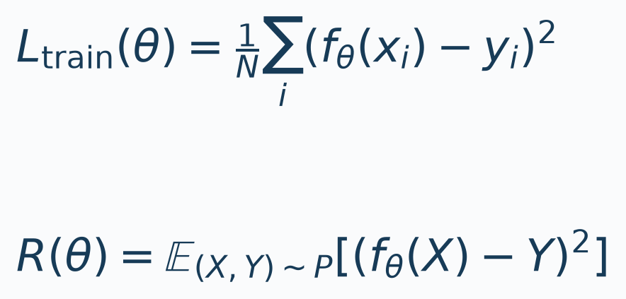

---

## Roles of training, validation, and test data

Roles of training, validation, and test data

TRAIN

Fit model parameters and preprocessing

VALIDATE

Choose degree, λ, learning rate, and stopping

TEST

Evaluate the frozen pipeline once

---

## Sensor-calibration data

Sensor-calibration data

18 training · 80 validation · 200 sealed test observations

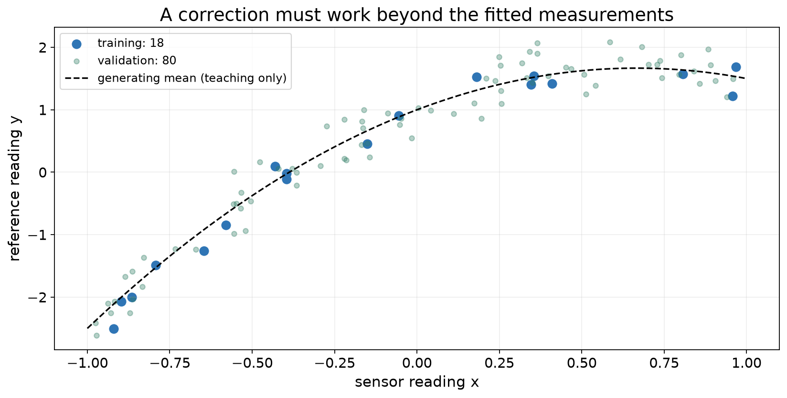

---

## Polynomial models and capacity

Polynomial regression

• Nonlinear in the input x. Linear in the learned coefficients.

• Φ: [N,d] w: [d,1] b: [1] predictions: [N,1]

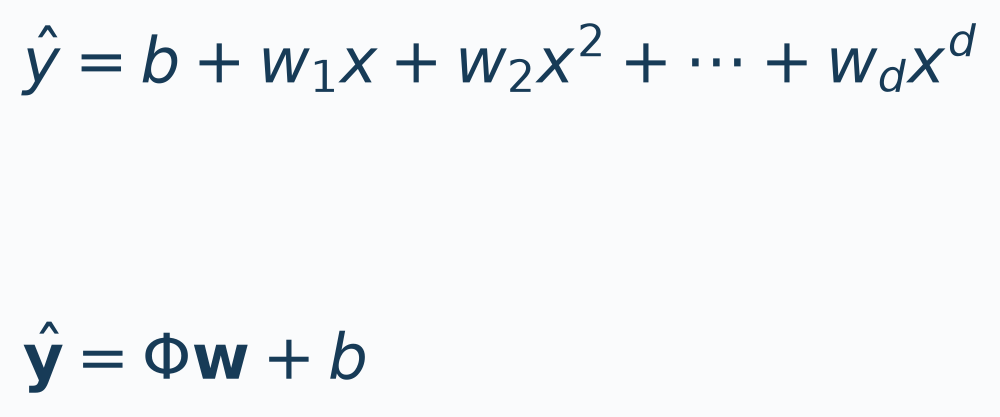

---

## Polynomial feature construction

Constructing polynomial features

• Degree 3: φ(x) = [x, x², x³]

• For x = 0: [0, 0, 0]

• For x = 2: [2, 4, 8]

• The intercept b is separate from these three features.

---

## Training error across polynomial degrees

Comparing polynomial degrees

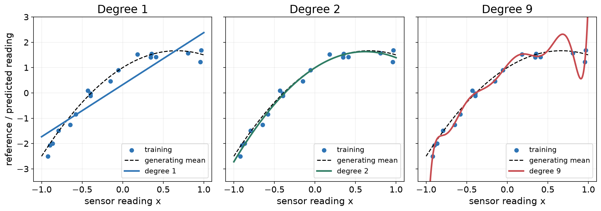

---

## Validation results across degrees

Training and validation results

Degree

Training MSE

Validation MSE

0.3263

0.3091

0.0259

0.0721

0.0252

0.0781

0.0082

0.2933

0.0051

0.1446

Selected degree: 2

---

## Error versus model degree

Error versus model degree

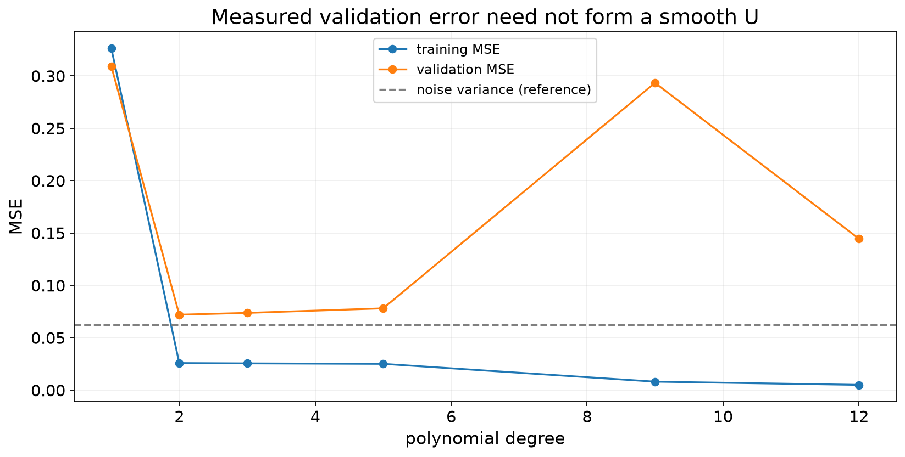

---

## Interpreting fit patterns

Interpreting error patterns

Both errors are high

• Check optimization

• Check model capacity

• Inspect data and features

Training is low; validation is worse

• Check overfitting

• Check population mismatch

• Audit leakage

---

## Model-selection protocol

Model-selection protocol

Define claim

→

Split

→

Fit preprocessing

→

Fit candidates

→

Validate

→

Freeze

→

Test

Define claim → split → fit preprocessing on training

Fit candidates on training → choose with validation

Freeze preprocessing + fitted model → evaluate test

---

## Preprocessing fitted on training data

Fit preprocessing on training data

• Compute each feature's μ and s on training data.

• Apply the same transformation to validation and test.

• Equal coefficient penalties depend on feature units.

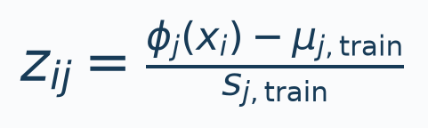

---

## Validation guides model development

Validation is part of development

• Trying more recipes spends validation information.

• A lucky minimum can overstate the winner's performance.

• Keep test evidence outside the development loop.

---

## L2 regularization

L2 regularization

Keep the mean squared data loss and leave the intercept unpenalized. For N examples, define

$$J(w,b)=\frac{1}{N}\sum_{i=1}^{N}(z_i^\top w+b-y_i)^2+\frac{\lambda}{2}\lVert w\rVert_2^2.$$

The penalty discourages large weights while allowing the intercept to represent the target offset.

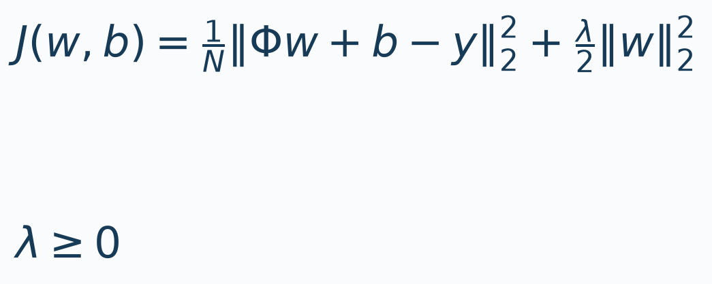

---

## Gradients with L2 regularization

Gradient of the regularized objective

With $e=Zw+b-y$, differentiating the data term and penalty gives

$$\nabla_w J=\frac{2}{N}Z^\top e+\lambda w,\qquad
\frac{\partial J}{\partial b}=\frac{2}{N}\mathbf{1}^\top e.$$

The intercept has no penalty term.

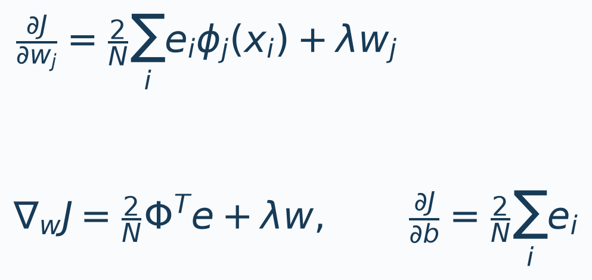

---

## SGD update with weight decay

The SGD update

For ordinary SGD without momentum, evaluate both gradients at $w,b$, then update:

$$w^+=w-\eta\left(\frac{2}{N}Z^\top e+\lambda w\right),\qquad
b^+=b-\eta\frac{2}{N}\mathbf{1}^\top e.$$

At $\lambda=0$, this is the linear regression update. Applying both the explicit penalty and optimizer weight decay would count the penalty twice.

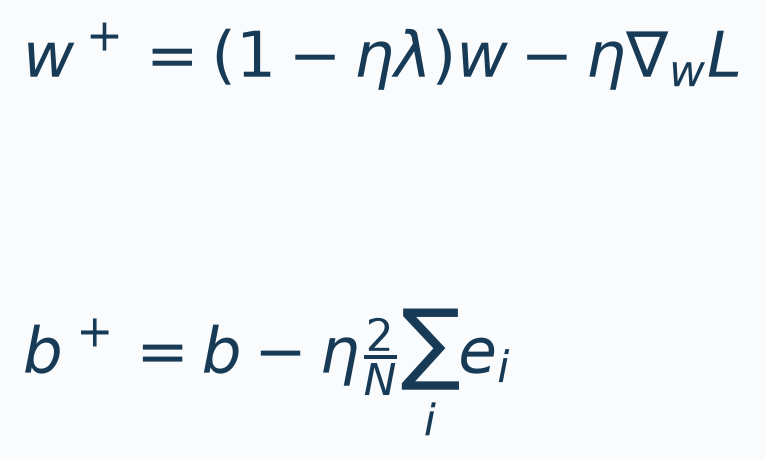

---

## Worked calculation

Φ = I₂ y = [1, 2]ᵀ

w = [2, −1]ᵀ b = 0.5

λ = 0.2 η = 0.1

Find residuals, MSE, penalty, gradients, and the new parameters.

---

## Worked calculation: one update

e = [1.5, −2.5]ᵀ

MSE = 4.25 penalty = 0.50 J = 4.75

∇wJ = [1.9, −2.7]ᵀ ∂J/∂b = −1

w⁺ = [1.81, −0.73]ᵀ b⁺ = 0.6

---

## Implementation of the regularized update

Implementing the derived update

• e = Z @ w + b − y

• grad_w = (2/N) * Z.T @ e + λ*w

• grad_b = 2 * mean(e)

• w = w − η*grad_w

• b = b − η*grad_b

---

## Training and validation curves

Training and validation curves

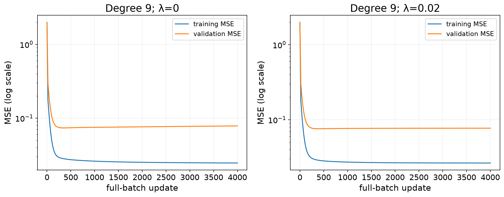

---

## Training metrics and the objective

Compare the same metric across splits

Prediction metrics

• Training MSE

• Validation MSE

• Same definition on both splits

Optimization objective

• J = training MSE + penalty

• Used to fit parameters

• Do not plot as validation MSE

---

## PyTorch implementation

PyTorch implementation

• optimizer = torch.optim.SGD([

• {"params": [net.weight], "weight_decay": lam},

• {"params": [net.bias], "weight_decay": 0.0},

• ], lr=eta, momentum=0.0)

• Backpropagate MSE only.

---

## Numerical equivalence check

Numerical equivalence check

METHOD 1

Explicit analytic gradient

METHOD 2

Autograd with an explicit L2 penalty

METHOD 3

SGD weight_decay on weights only

With matching precision, initialization, loss reduction, and updates, all three agree.

---

## Selecting λ with validation data

Selecting the regularization strength

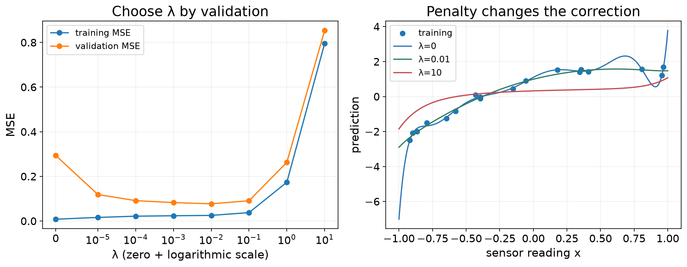

---

## Final test evaluation

Final evaluation on test data

SELECTED MODEL

Degree-2 polynomial

TEST MSE

0.08549

TEST RMSE

0.29238

INTERPRETATION

• Baseline test MSE: 1.89395

• Population: fresh IID calibration readings

• Input range: x ∈ [−1, 1]

This evidence does not establish performance on a new wearer.

---

## Preprocessing leakage

Preprocessing leakage

• Training readings: [0, 2] held-out reading: [10]

• Training mean = 1 pooled mean = 4

• Correct centred training readings: [−1, 1]

• Pooled-centred training readings: [−4, −2]

---

## Split design follows deployment

Match the split to deployment

Known wearers

New measurements

New wearers

Hold out complete subjects

New sessions

Hold out sessions and audit identities

Future use

Respect chronology and prediction horizon

---

## Random and grouped splits

Random-row and grouped splits

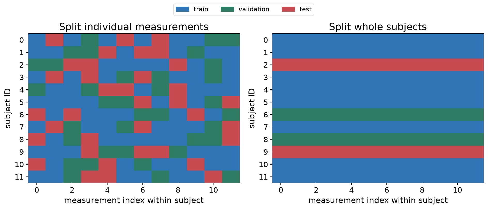

---

## Audit grouped assignments

Audit grouped splits

• Record train, validation, and test subject IDs.

• Check all three pairwise intersections are empty.

• Check every intended row belongs to exactly one split.

• Fit preprocessing using training subjects only.

---

## Overlapping windows

Overlapping windows

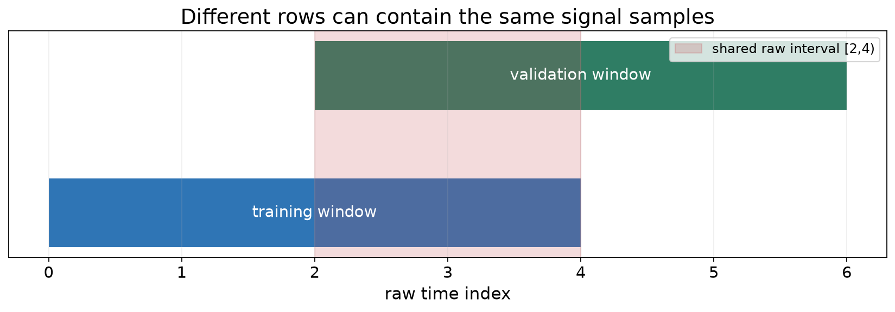

---

## Split before window extraction

Split before constructing windows

• Split raw groups or time blocks before window extraction.

• Discard boundary-crossing windows.

• Choose a gap from input history, label horizon, and dependence.

• For new-person claims, keep every session of a person together.

---

## Variation across repeated datasets

Variation across repeated datasets

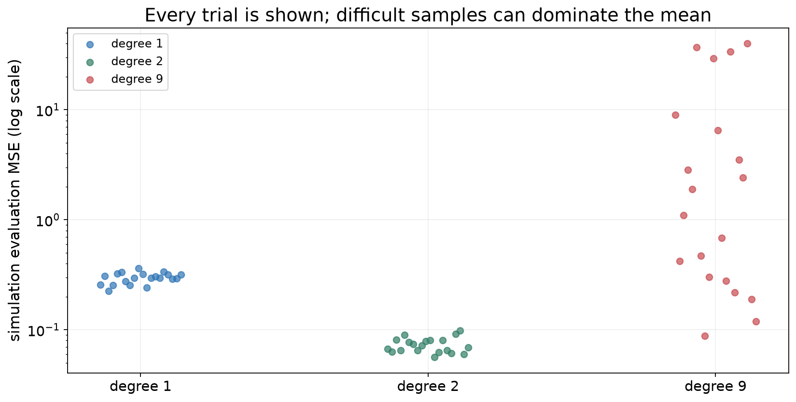

---

## Sources of uncertainty

Report what varied

Spread across runs

• Describe with mean and sample SD

• State what changed

• Report the number of runs

Confidence interval

• Name the estimand

• Use the independent sampling unit

• State what uncertainty is excluded

---

## Uncertainty across subjects

Uncertainty across subjects

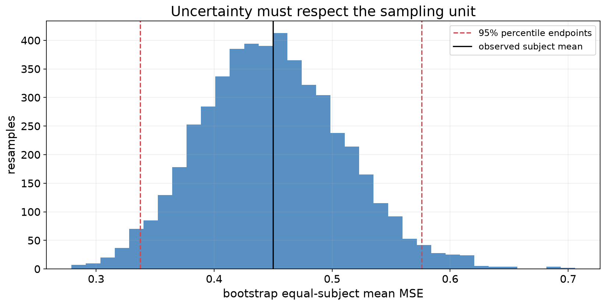

---

## Evaluation protocol

Evaluation protocol

Define claim

→

Split

→

Fit

→

Validate

→

Freeze

→

Test

→

Report

Claim → split → baseline → fit

→ validate → freeze → test → report

A small score is meaningful only with its evaluation protocol.

---

## Beyond the training range

Beyond the training range

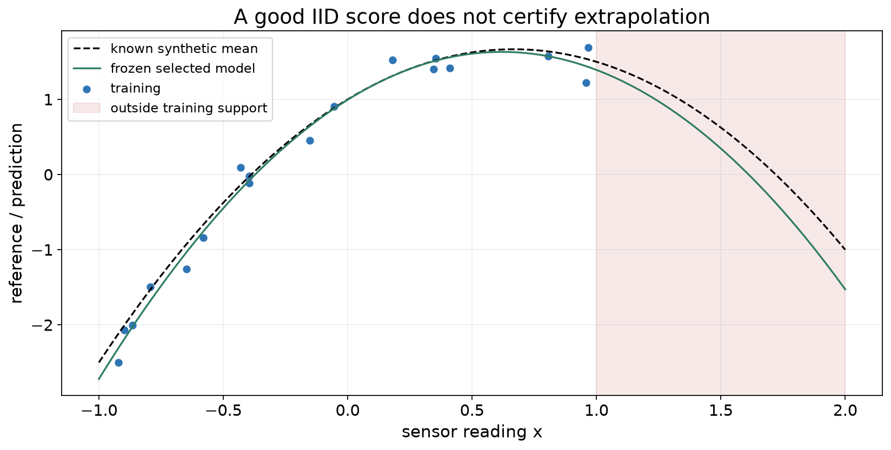

---

## Ridge-regression reference

Ridge-regression reference

• A = [1,Z], β = [b;w], P = [0,I]. Multiply J by N.

• Add penalty rows √(Nλ/2) P and zero targets.

• Solve the augmented least-squares problem without an inverse.

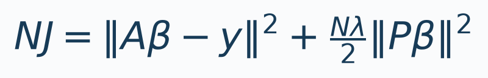
