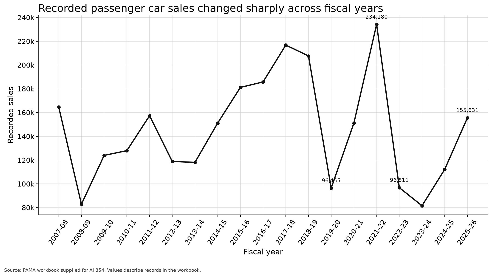
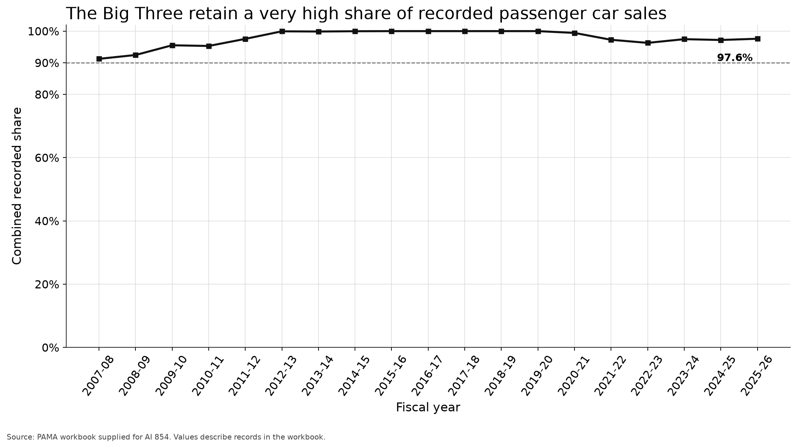
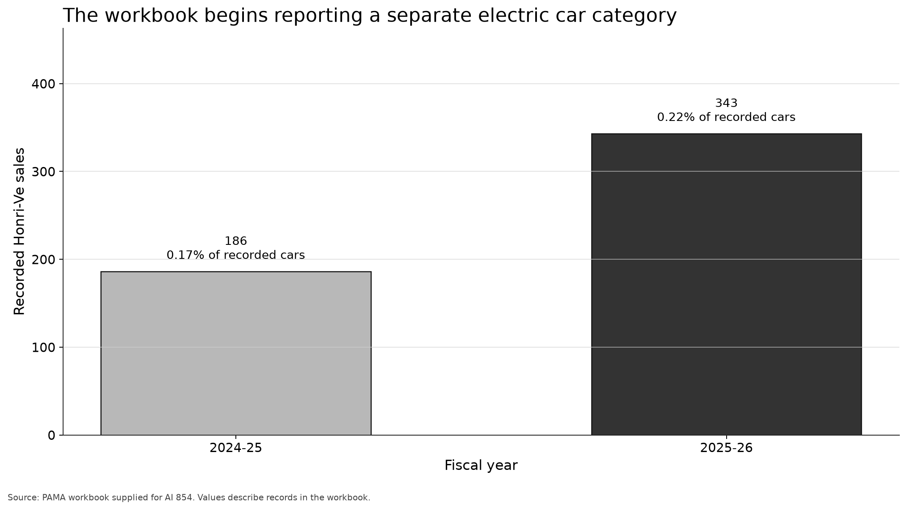

# Lecture 1 student evidence pack

## Group decision

Evaluate this statement:

> New and electric vehicle brands are breaking the dominance of Pakistan's traditional Big Three.

Choose one position:

- Supported
- Not supported
- Cannot be answered adequately

## Evidence A  Recorded passenger car sales

Selected fiscal year totals:

| Fiscal year | Recorded passenger car sales |
|---|---:|
| 2007 to 2008 | 164,650 |
| 2011 to 2012 | 157,325 |
| 2015 to 2016 | 181,145 |
| 2018 to 2019 | 207,630 |
| 2019 to 2020 | 96,455 |
| 2021 to 2022 | 234,180 |
| 2022 to 2023 | 96,811 |
| 2023 to 2024 | 81,579 |
| 2024 to 2025 | 112,203 |
| 2025 to 2026 | 155,631 |

## Evidence B  Big Three share within the records

CR3 adds the recorded shares of Suzuki, Toyota, and Honda.

## Evidence C  Electric car category

| Fiscal year | Honri-Ve recorded sales | Total recorded passenger car sales |
|---|---:|---:|
| 2024 to 2025 | 186 | 112,203 |
| 2025 to 2026 | 343 | 155,631 |

## Source note

The workbook comes from the Pakistan Automotive Manufacturers Association. It reports production and sales for named vehicle models and categories. The workbook should not automatically be treated as a complete record of every imported vehicle, every nonmember manufacturer, or every new vehicle registration in Pakistan.

Source: https://pama.org.pk/monthly-production-sales-of-vehicles/

## Group response

### 1  Position

Supported / Not supported / Cannot be answered adequately

### 2  Strongest supporting observation

Write one number or visible pattern. State its denominator.

____________________________________________________________________

____________________________________________________________________

### 3  Most important limitation

____________________________________________________________________

____________________________________________________________________

### 4  Additional data needed

____________________________________________________________________

### 5  Final conclusion in no more than two sentences

____________________________________________________________________

____________________________________________________________________

____________________________________________________________________

## Role check

- Analyst: proposed the interpretation
- Skeptic: challenged unsupported wording
- Spokesperson: can defend the final conclusion

