# Lecture 5: Medical Evidence — The Mathematics Behind the Chart

56 slides. Core route plus four optional data extensions (22, 29, 35, and 48) and two reference pages (55–56). The 28 figures are reproduced from the executed notebook.

Instructor timing and board derivations: [BOARD_PLAN.md](BOARD_PLAN.md).

---

## Slide 01: Medical Evidence

- The Mathematics Behind the Chart
- Lecture 5 · Data Analysis and Visualization
- Cholesterol, HDL/LDL, and added sugar

---

## Slide 02: The health editor’s brief

- Three pitches arrive at the health desk.
- Your job: calculate what each study establishes and decide what the editor can publish.
- Deliver a repaired figure and a quantitative evidence brief.

**Teaching note:** Ask students to act as analysts. The real work is sourcing tables, auditing units, defining the comparison, estimating effects, visualizing uncertainty, and defending a conclusion.

---

## Slide 03: Three pitches to investigate

- “Cholesterol causes heart disease.”
- “Raising good cholesterol protects the heart.”
- “Sugar is the real culprit, so cholesterol was wrongly blamed.”

**Teaching note:** These are deliberately simplified pitches, not the lecture conclusions. Students vote supported / unsupported / needs a narrower claim. Record their initial answers. Revisit on slide 53.

---

## Slide 04: A documented history of selected evidence

- A historical analysis examined Sugar Research Foundation internal documents.
- It described sponsorship that shaped a 1967 review’s treatment of sugar and fat evidence.
- Funding history gives us a reason to inspect the evidence and disclosures.

Sources: [source 1](https://pubmed.ncbi.nlm.nih.gov/27617709/)

**Teaching note:** Two minutes only. Describe the documented historical case without claiming that all industry-funded studies are false. Do not use history as proof of the three medical claims.

---

## Slide 05: The measurements behind the headlines

|Measurement|What it measures|
|---|---|
|Total cholesterol|Cholesterol across circulating fractions|
|LDL-C / HDL-C|Cholesterol carried in LDL / HDL|
|Added sugar|Dietary sugar added during preparation|
|Blood glucose / HbA1c|Measures related to blood glucose|

- Non-HDL-C = total cholesterol − HDL-C

Sources: [source 1](https://pmc.ncbi.nlm.nih.gov/articles/PMC5837225/), [source 2](https://doi.org/10.1001/jamainternmed.2013.13563)

**Teaching note:** Cholesterol is a molecule. LDL and HDL are carriers. Laboratory concentration, dietary exposure and clinical outcome are different variables. Added sugar is not fasting glucose.

---

## Slide 06: Three studies, three distinct comparisons

|Study / design|Comparison|Outcome|
|---|---|---|
|HPS / randomized|Simvastatin vs placebo|Major vascular event|
|AIM-HIGH / randomized|Niacin vs placebo, both on statin|Primary cardiovascular composite|
|NHANES / linked cohort|Added-sugar quintiles|Cardiovascular mortality|

- Each finding keeps its population, endpoint, and time frame.

Sources: [source 1](https://doi.org/10.1016/S0140-6736(02)09327-3), [source 2](https://doi.org/10.1056/NEJMoa1107579), [source 3](https://doi.org/10.1001/jamainternmed.2013.13563)

**Teaching note:** HPS: high-risk UK adults, scheduled five-year period. AIM-HIGH: established CVD and low HDL on intensive statin therapy, mean three years. Sugar cohort: US adults, median 14.6-year follow-up. Do not compare absolute rates across studies as if randomized to those studies.

---

## Slide 07: The source audit

- Rows represent published group summaries or model estimates.
- Check unique keys, positive denominators, events ≤ participants, and ordered interval bounds.
- Keep extracted values separate from calculated values.
- Overlapping outcome components cannot be added.

**Teaching note:** Open data_dictionary.md and inspect CSVs. Distinguish raw source verification, transcribed tables and computed outputs. No individual-patient rows are fabricated from summaries.

---

## Slide 08: The HPS event counts

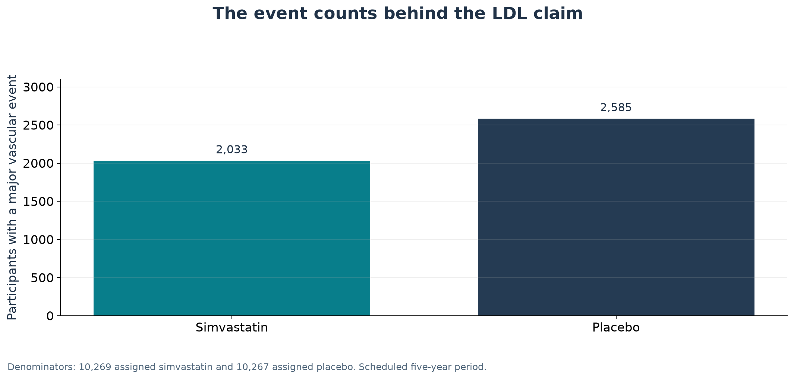

Denominators: 10,269 assigned simvastatin and 10,267 assigned placebo. Scheduled five-year period.

- A count comparison needs the assigned-arm denominators.

Sources: [source 1](https://doi.org/10.1016/S0140-6736(02)09327-3)

**Teaching note:** Write 2,033 / 10,269 and 2,585 / 10,267. Participants contribute once to this selected composite endpoint.
Denominators: 10,269 assigned simvastatin and 10,267 assigned placebo. Scheduled five-year period.

---

## Slide 09: Binary outcomes and estimated risk

`Yᵢ ∈ {0, 1},     P(Yᵢ = 1) = p`

`p̂ = (1/n) ΣYᵢ = e/n`

`E(p̂) = (1/n) ΣE(Yᵢ) = p`

- One participant, one indicator for the defined endpoint.

**Teaching note:** BOARD 1. Derive the mean estimator, rather than just presenting a function. State the independent-Bernoulli teaching approximation and fixed assigned-arm denominator. This is a cumulative proportion, not a survival-model refit.

---

## Slide 10: Variance of the estimated risk

`Var(Yᵢ) = E(Yᵢ²) − [E(Yᵢ)]² = p(1 − p)`

`Var(p̂) = (1/n²) ΣVar(Yᵢ)`

`Var(p̂) = p(1 − p)/n`

- Independence removes the cross-person covariance terms.

**Teaching note:** BOARD 1 continued. First write Var(sum) with covariance terms, then invoke independence. Plug p-hat into the variance for an estimated standard error. Random treatment assignment supports the comparison but does not automatically justify every modeling assumption.

---

## Slide 11: Absolute and relative treatment effects

`ARR = p̂C − p̂T`

`RR = p̂T / p̂C`

`RRR = 1 − RR`

- ARR uses probability units. RR and RRR are relative quantities.

**Teaching note:** BOARD 2. C = placebo and T = simvastatin. Positive ARR means fewer affected participants on treatment. Explain percentage points versus percent reduction before substituting numbers.

---

## Slide 12: The HPS hand calculation

`p̂T = 2,033 / 10,269 = 0.19797`

`p̂C = 2,585 / 10,267 = 0.25178`

`ARR = 0.05380     RR = 0.78631`

- 5.38 percentage points lower risk, or 21.4% count-based relative reduction.

Sources: [source 1](https://doi.org/10.1016/S0140-6736(02)09327-3)

**Teaching note:** Give students two minutes to calculate on paper before revealing results. The paper’s roughly 24% event-rate reduction uses logrank analysis. Our 21.4% uses cumulative event proportions. Do not silently replace one with the other.

---

## Slide 13: Incomplete exhibit: a restricted bar axis

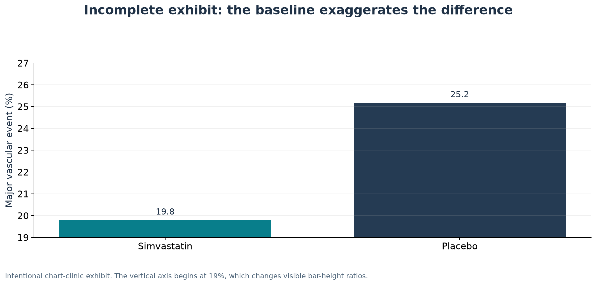

Intentional chart-clinic exhibit. The vertical axis begins at 19%, which changes visible bar-height ratios.

- Intentional chart clinic. The axis begins at 19%.

Sources: [source 1](https://doi.org/10.1016/S0140-6736(02)09327-3)

**Teaching note:** Ask students to describe visible bar lengths before interpreting the trial. The numbers are authentic. The display exaggerates their relative magnitude.
Intentional chart-clinic exhibit. The vertical axis begins at 19%, which changes visible bar-height ratios.

---

## Slide 14: The mathematics of axis distortion

`Visible height ratio = (pC − b)/(pT − b)`

`b = 19%:     6.1778 / 0.7974 ≈ 7.75`

`Actual risk ratio C/T = 25.1778 / 19.7974 ≈ 1.27`

- Subtracting a baseline changes bar-length ratios.

Sources: [source 1](https://doi.org/10.1016/S0140-6736(02)09327-3)

**Teaching note:** BOARD 3. Use percentages consistently in this calculation. The 7.75 is a visual-height ratio, not a treatment effect. Draw both baselines. The original trial difference remains unchanged.

---

## Slide 15: The repaired HPS risk comparison

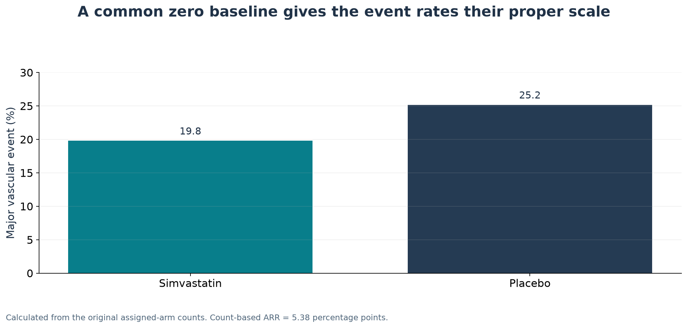

Calculated from the original assigned-arm counts. Count-based ARR = 5.38 percentage points.

- A common zero baseline preserves magnitude by bar length.

Sources: [source 1](https://doi.org/10.1016/S0140-6736(02)09327-3)

**Teaching note:** Run the corresponding notebook cell and change only the axis minimum. Ask which interpretation now fits the encoding.
Calculated from the original assigned-arm counts. Count-based ARR = 5.38 percentage points.

---

## Slide 16: Event and event-free framing

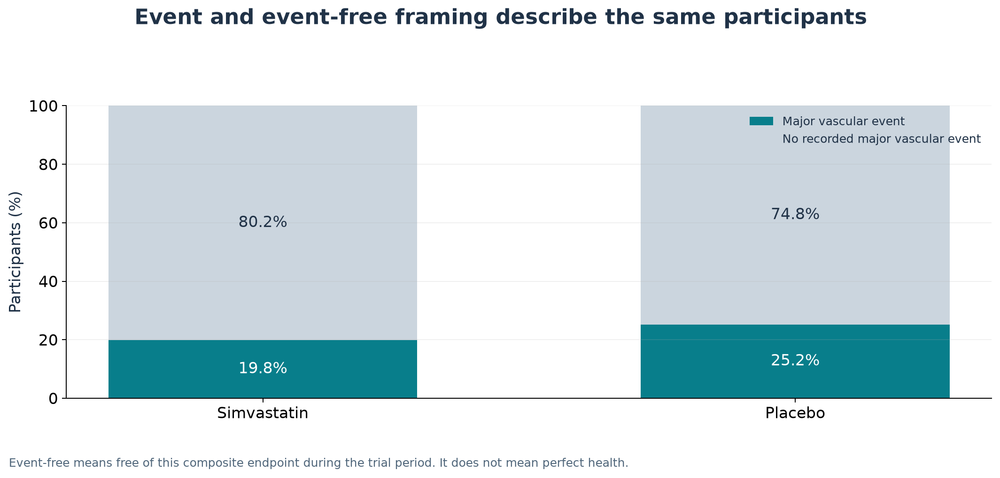

Event-free means free of this composite endpoint during the trial period. It does not mean perfect health.

- Complementary proportions describe the same endpoint.

Sources: [source 1](https://doi.org/10.1016/S0140-6736(02)09327-3)

**Teaching note:** Students calculate 100 minus the event percentage. Event-free does not mean perfect health. Color the defined outcome consistently.
Event-free means free of this composite endpoint during the trial period. It does not mean perfect health.

---

## Slide 17: About 54 fewer affected people per 1,000

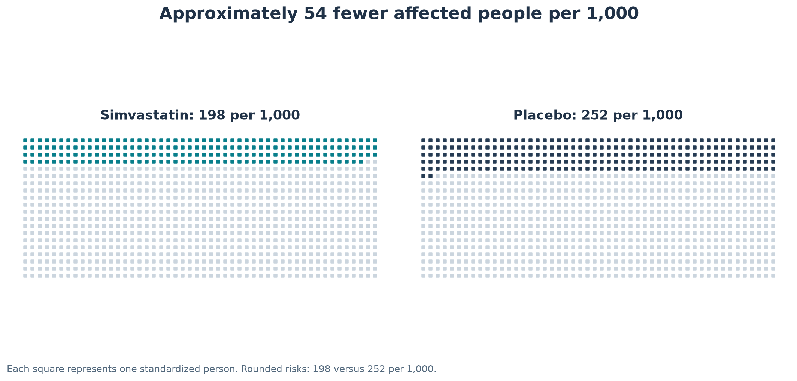

Each square represents one standardized person. Rounded risks: 198 versus 252 per 1,000.

- Equal denominators turn the treatment difference into a count.

Sources: [source 1](https://doi.org/10.1016/S0140-6736(02)09327-3)

**Teaching note:** Each square is a standardized person based on rounded risk, not a reconstructed patient. 198 versus 252 per 1,000. Discuss how this framing differs from a relative reduction.
Each square represents one standardized person. Rounded risks: 198 versus 252 per 1,000.

---

## Slide 18: Uncertainty in the absolute benefit

`SE(ARR) = √[p̂C(1 − p̂C)/nC + p̂T(1 − p̂T)/nT]`

`SE = 0.005815`

`Approximate 95% CI = ARR ± 1.96 × SE`

- The independent-arm variance adds. The difference’s null value is 0.

**Teaching note:** BOARD 4. Derive variance of C minus T and explain why the minus sign does not subtract variances. Large-sample normal approximation. A 95% confidence procedure concerns repeated sampling, not a 95% posterior probability of this fixed parameter.

---

## Slide 19: The estimated absolute benefit and its range

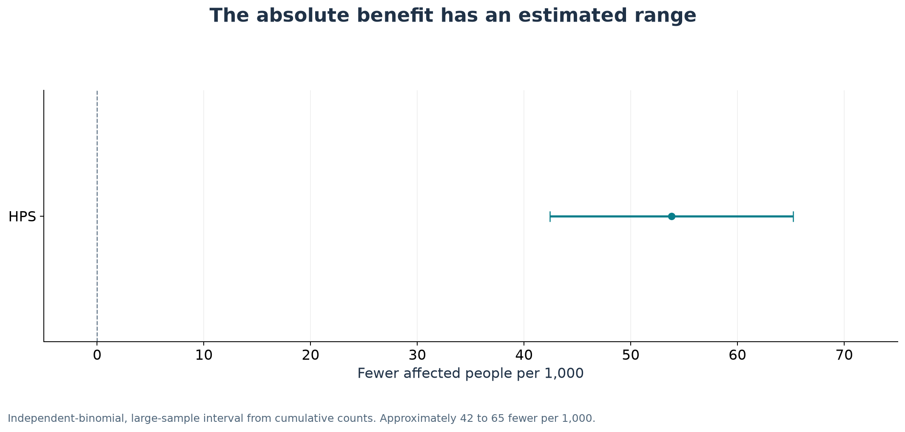

Independent-binomial, large-sample interval from cumulative counts. Approximately 42 to 65 fewer per 1,000.

- Approximately 54 fewer per 1,000, with a 42–65 interval.

Sources: [source 1](https://doi.org/10.1016/S0140-6736(02)09327-3)

**Teaching note:** CI is a classroom independent-binomial approximation. Multiply estimate and both bounds by 1,000. Reference 0 means no absolute benefit.
Independent-binomial, large-sample interval from cumulative counts. Approximately 42 to 65 fewer per 1,000.

---

## Slide 20: The normal approximation behind the interval

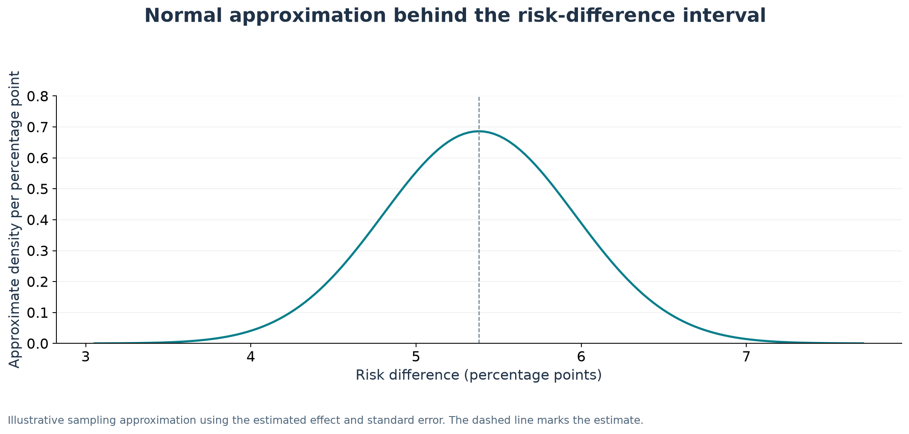

Illustrative sampling approximation using the estimated effect and standard error. The dashed line marks the estimate.

- A sampling model explains the 1.96 × SE construction.

Sources: [source 1](https://doi.org/10.1016/S0140-6736(02)09327-3)

**Teaching note:** This curve is a statistical illustration centered on the estimate. It is neither the distribution of patient outcomes nor a posterior distribution.
Illustrative sampling approximation using the estimated effect and standard error. The dashed line marks the estimate.

---

## Slide 21: HPS benefit across baseline LDL groups

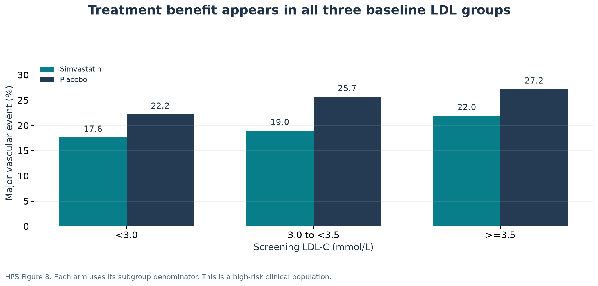

HPS Figure 8. Each arm uses its subgroup denominator. This is a high-risk clinical population.

- Each subgroup comparison uses its own denominator.

Sources: [source 1](https://doi.org/10.1016/S0140-6736(02)09327-3)

**Teaching note:** Treatment was randomized. Baseline LDL categories were not. Do not infer an untreated molecular dose response just from these bars.
HPS Figure 8. Each arm uses its subgroup denominator. This is a high-risk clinical population.

---

## Slide 22: LDL subgroup estimates with uncertainty · optional extension

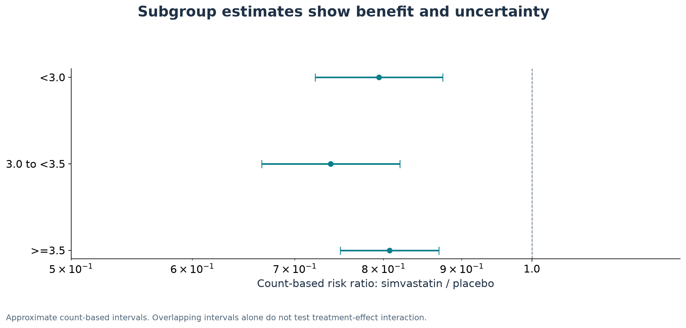

Approximate count-based intervals. Overlapping intervals alone do not test treatment-effect interaction.

- All three count-based intervals lie below the ratio null of 1.

Sources: [source 1](https://doi.org/10.1016/S0140-6736(02)09327-3)

**Teaching note:** Extension: overlapping intervals do not test treatment-effect interaction. Keep screening LDL units mmol/L. These intervals are computed, not the paper’s logrank intervals.
Approximate count-based intervals. Overlapping intervals alone do not test treatment-effect interaction.

---

## Slide 23: The LDL finding

- HPS demonstrates fewer major vascular events with assignment to simvastatin.
- The count-based benefit is about 54 fewer affected people per 1,000 during the trial period.
- Broader genetic, cohort, and intervention evidence establishes LDL as a causal contributor to atherosclerotic disease.

Sources: [source 1](https://doi.org/10.1016/S0140-6736(02)09327-3), [source 2](https://pmc.ncbi.nlm.nih.gov/articles/PMC5837225/)

**Teaching note:** Close Act 1 explicitly. A statin trial alone does not isolate every molecular mechanism. The broader causal claim comes from the cited converging evidence. Total cholesterol should not collapse LDL and HDL into one label.

---

## Slide 24: Higher baseline HDL and lower event proportions

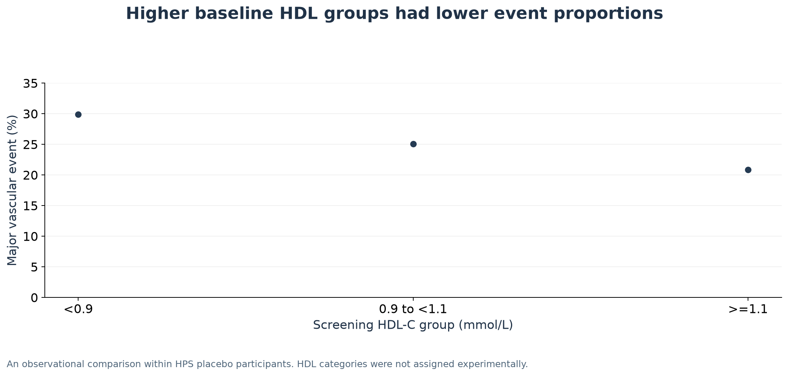

An observational comparison within HPS placebo participants. HDL categories were not assigned experimentally.

- Baseline HDL categories describe an observational comparison.

Sources: [source 1](https://doi.org/10.1016/S0140-6736(02)09327-3)

**Teaching note:** HPS placebo participants. HDL was not assigned. A favorable association motivates a treatment hypothesis but does not prove that raising HDL will help.
An observational comparison within HPS placebo participants. HDL categories were not assigned experimentally.

---

## Slide 25: Incomplete exhibit: HDL rose on niacin

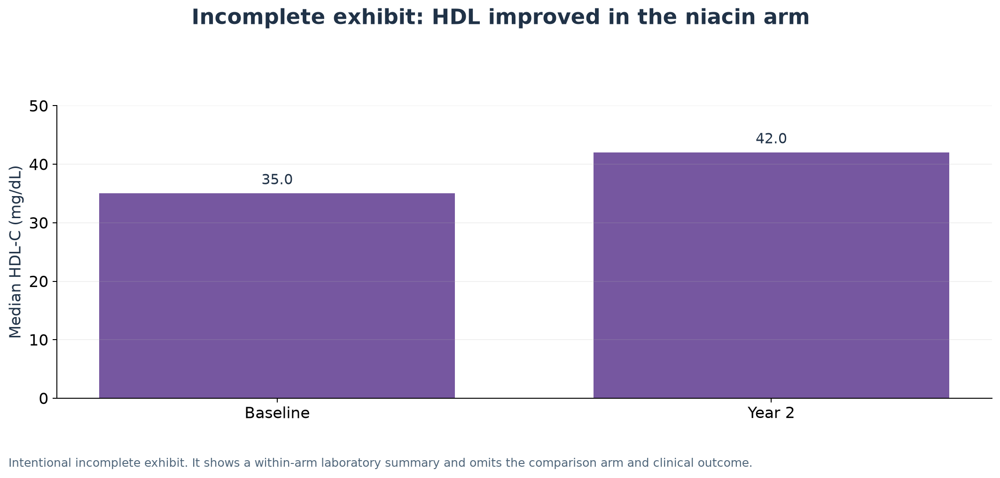

Intentional incomplete exhibit. It shows a within-arm laboratory summary and omits the comparison arm and clinical outcome.

- The niacin arm’s median HDL increased from 35 to 42 mg/dL.

Sources: [source 1](https://doi.org/10.1056/NEJMoa1107579)

**Teaching note:** Ask what the protection claim still needs. Missing comparison arm and clinical outcome. The within-arm change is authentic but incomplete.
Intentional incomplete exhibit. It shows a within-arm laboratory summary and omits the comparison arm and clinical outcome.

---

## Slide 26: HDL trajectories in both trial arms

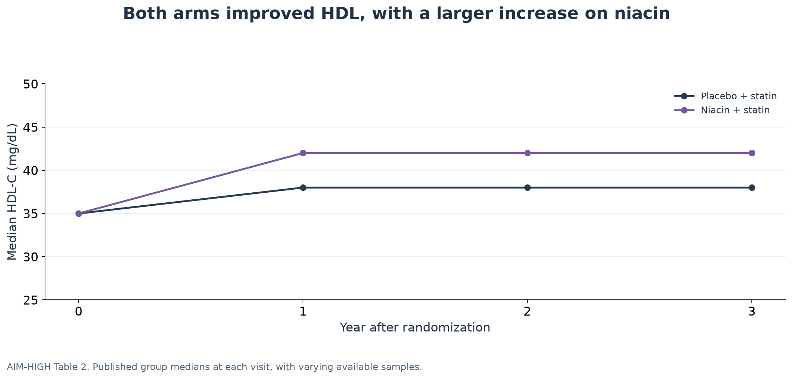

AIM-HIGH Table 2. Published group medians at each visit, with varying available samples.

- Both arms improved. Niacin produced a larger HDL increase.

Sources: [source 1](https://doi.org/10.1056/NEJMoa1107579)

**Teaching note:** AIM-HIGH Table 2. Published group medians at each visit, with varying available samples. Lines connect visit summaries rather than identical patient trajectories.
AIM-HIGH Table 2. Published group medians at each visit, with varying available samples.

---

## Slide 27: Laboratory spread and estimate uncertainty

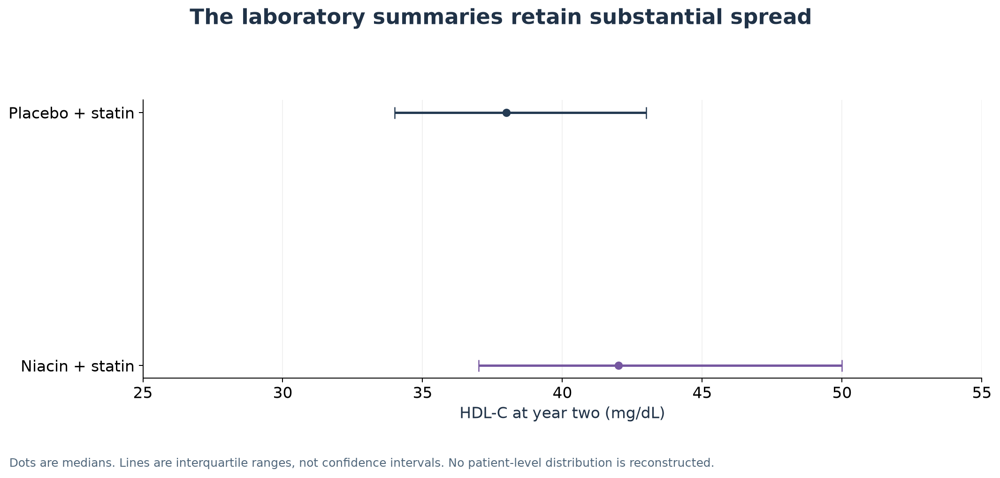

Dots are medians. Lines are interquartile ranges, not confidence intervals. No patient-level distribution is reconstructed.

- Dots show year-two medians. Lines show interquartile ranges.

Sources: [source 1](https://doi.org/10.1056/NEJMoa1107579)

**Teaching note:** IQR describes the central half of laboratory values. It is not a 95% confidence interval on a median or treatment effect. A box plot cannot be reconstructed fully from these three summaries.
Dots are medians. Lines are interquartile ranges, not confidence intervals. No patient-level distribution is reconstructed.

---

## Slide 28: Two valid HDL percentage summaries

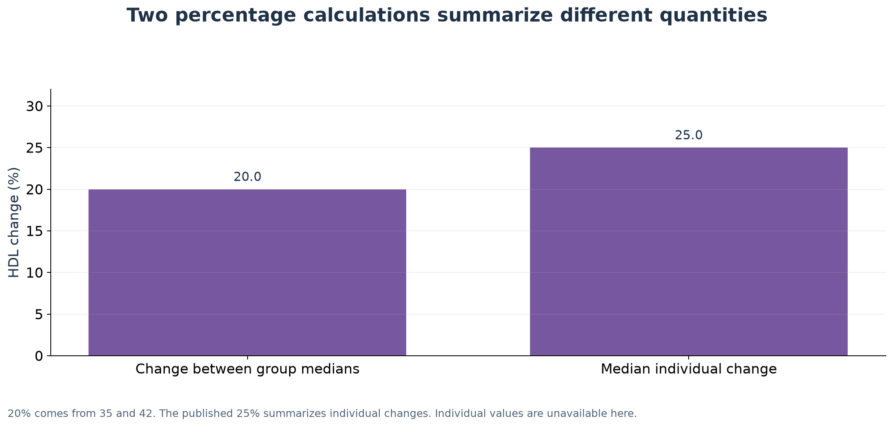

20% comes from 35 and 42. The published 25% summarizes individual changes. Individual values are unavailable here.

- Change between group medians = 20%. Median individual change = 25%.

Sources: [source 1](https://doi.org/10.1056/NEJMoa1107579)

**Teaching note:** BOARD 5. (42−35)/35×100=20%. Source reports median of individual percent changes of 25%. Median and percentage change do not commute. Visit samples also vary. Individual change data are unavailable, so do not refit them.
20% comes from 35 and 42. The published 25% summarizes individual changes. Individual values are unavailable here.

---

## Slide 29: Available laboratory samples vary by visit · optional extension

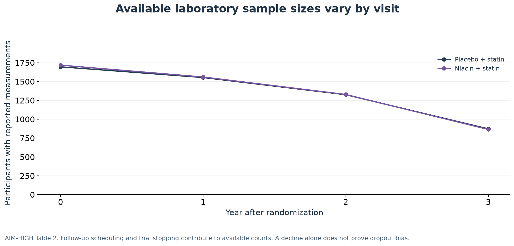

AIM-HIGH Table 2. Follow-up scheduling and trial stopping contribute to available counts. A decline alone does not prove dropout bias.

- A visit summary includes the participants measured at that visit.

Sources: [source 1](https://doi.org/10.1056/NEJMoa1107579)

**Teaching note:** Reserve diagnostic. Scheduling and early trial stopping affect available counts. A decreasing curve alone does not demonstrate biased dropout.
AIM-HIGH Table 2. Follow-up scheduling and trial stopping contribute to available counts. A decline alone does not prove dropout bias.

---

## Slide 30: The clinical outcome does not show added benefit

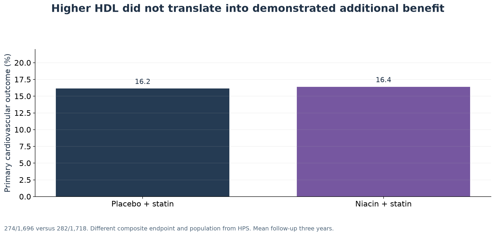

274/1,696 versus 282/1,718. Different composite endpoint and population from HPS. Mean follow-up three years.

- Primary event proportions were 16.2% and 16.4%.

Sources: [source 1](https://doi.org/10.1056/NEJMoa1107579)

**Teaching note:** 274/1,696 placebo add-on versus 282/1,718 niacin add-on. Mean follow-up three years. Preserve this trial’s distinct composite endpoint.
274/1,696 versus 282/1,718. Different composite endpoint and population from HPS. Mean follow-up three years.

---

## Slide 31: The delta method for log risk

`log(p̂) ≈ log(p) + (p̂ − p)/p`

`Var[log(p̂)] ≈ Var(p̂)/p²`

`Var[log(p̂)] ≈ (1 − p)/(np)`

- A first-order expansion carries uncertainty through the logarithm.

**Teaching note:** BOARD 6. Draw a tangent conceptually on the board. Derivative d log(p)/dp = 1/p. Square the derivative in variance propagation. State nonzero events and adequate sample sizes.

---

## Slide 32: The log-risk-ratio interval

`log(RR) = log(p̂T) − log(p̂C)`

`SE[log(RR)] = √(1/eT − 1/nT + 1/eC − 1/nC)`

`95% CI = exp{log(RR) ± 1.96 × SE}`

- AIM-HIGH count-based RR = 1.016, approximate CI 0.873–1.183.

Sources: [source 1](https://doi.org/10.1056/NEJMoa1107579)

**Teaching note:** BOARD 6 continued. Substitute p-hat=e/n to derive 1/e−1/n. Add independent-arm variances. Exponentiate both endpoints. The resulting interval is asymmetric on the original ratio scale.

---

## Slide 33: Cumulative risk ratio and reported hazard ratio

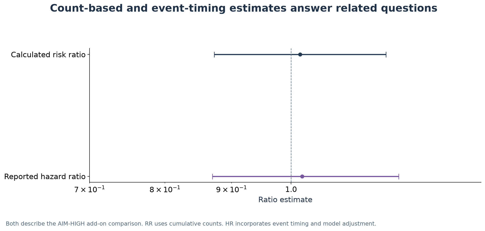

Both describe the AIM-HIGH add-on comparison. RR uses cumulative counts. HR incorporates event timing and model adjustment.

- Counts and event timing define different estimators.

Sources: [source 1](https://doi.org/10.1056/NEJMoa1107579)

**Teaching note:** Computed cumulative RR 1.016 with approximate CI 0.873–1.183. Published adjusted HR 1.02 with CI 0.87–1.21. Numerical similarity does not make the estimands identical.
Both describe the AIM-HIGH add-on comparison. RR uses cumulative counts. HR incorporates event timing and model adjustment.

---

## Slide 34: The reported AIM-HIGH outcome interval

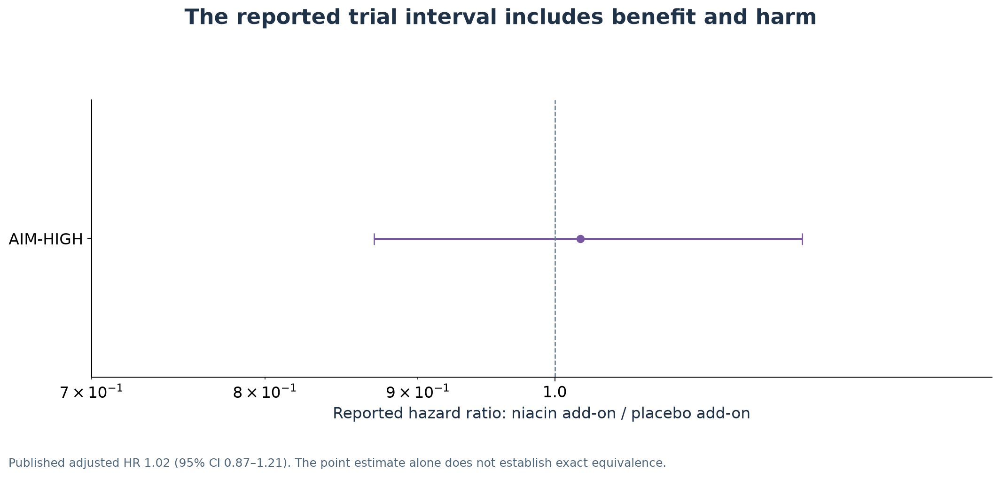

Published adjusted HR 1.02 (95% CI 0.87–1.21). The point estimate alone does not establish exact equivalence.

- HR 1.02, 95% CI 0.87–1.21. Benefit was not demonstrated.

Sources: [source 1](https://doi.org/10.1056/NEJMoa1107579)

**Teaching note:** The interval includes potentially lower and higher hazards. The trial does not establish exact equality, that HDL is harmful, or that every HDL-targeting intervention must fail.
Published adjusted HR 1.02 (95% CI 0.87–1.21). The point estimate alone does not establish exact equivalence.

---

## Slide 35: Niacin changed several lipid measurements · optional extension

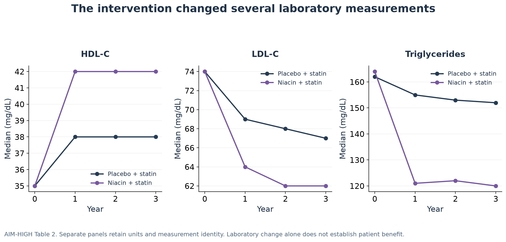

AIM-HIGH Table 2. Separate panels retain units and measurement identity. Laboratory change alone does not establish patient benefit.

- Separate panels retain the analytes and their units.

Sources: [source 1](https://doi.org/10.1056/NEJMoa1107579)

**Teaching note:** Reserve extension. Niacin changes HDL, LDL and triglycerides. The randomized intervention is not an isolated manipulation of HDL concentration. Do not manufacture a relationship using a dual axis.
AIM-HIGH Table 2. Separate panels retain units and measurement identity. Laboratory change alone does not establish patient benefit.

---

## Slide 36: The HDL finding

- Higher baseline HDL can accompany lower event rates.
- Adding niacin increased HDL but did not demonstrate additional cardiovascular benefit in AIM-HIGH.
- An improved biomarker alone cannot establish improved patient outcomes.

Sources: [source 1](https://doi.org/10.1016/S0140-6736(02)09327-3), [source 2](https://doi.org/10.1056/NEJMoa1107579)

**Teaching note:** Close Act 2. This is a definite finding about a specific intervention and population. Avoid saying HDL is useless or all HDL function lacks importance.

---

## Slide 37: The geometry of a logarithmic ratio axis

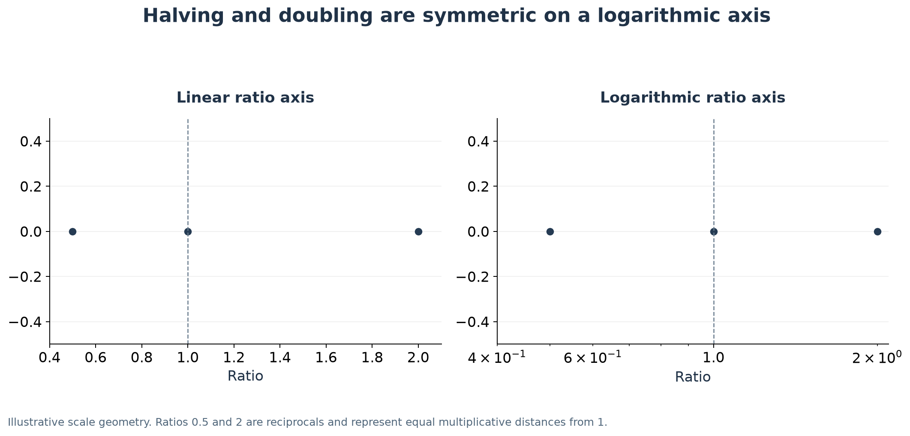

Illustrative scale geometry. Ratios 0.5 and 2 are reciprocals and represent equal multiplicative distances from 1.

- Ratios 0.5 and 2 sit equally far from the null of 1.

Sources: Mathematical illustration

**Teaching note:** BOARD 7. u(r)=log(r). u(2)=−u(0.5). Equal distances represent equal multiplicative changes. The example ratios illustrate geometry, not measured effects.
Illustrative scale geometry. Ratios 0.5 and 2 are reciprocals and represent equal multiplicative distances from 1.

---

## Slide 38: References and visual encodings

|Quantity|Reference|Useful encoding|
|---|---|---|
|Event proportion|Zero bar baseline|Common-scale bars|
|Absolute difference|0 means no difference|Point with interval|
|Risk / hazard ratio|1 means equal ratio|Point with interval on log axis|
|Ordered exposure|Numeric exposure positions|Points for all reported groups|

**Teaching note:** Position is more flexible than bar length for ratios and differences. Restricting a dot axis can be appropriate when labeled. Use consistent arm colors, explicit units and visible uncertainty. No smoothing through five sugar summaries.

---

## Slide 39: Break

- 15 minutes
- After the break: does the sugar evidence overturn the cholesterol finding?

**Teaching note:** Minutes 105–120. Core route may skip slides 22, 29 and 35 if needed. Keep the sugar section and final verdict intact.

---

## Slide 40: Added sugar as an energy-normalized exposure

`S% = 100 × (4 × gadded) / Etotal`

- gadded is grams of added sugar. Etotal is total kcal.
- NHANES Table 2 reports quintiles of usual added-sugar energy share.
- Quintile midvalues locate groups. They are not clinical thresholds.

Sources: [source 1](https://doi.org/10.1001/jamainternmed.2013.13563)

**Teaching note:** BOARD 8. Each gram of sugar contributes about four kcal. This analysis measures added sugar, not all carbohydrate and not blood glucose. Study usual-intake methods account for dietary measurement rather than assuming a single day is perfect usual intake.

---

## Slide 41: Two hypothetical diets with the same sugar share

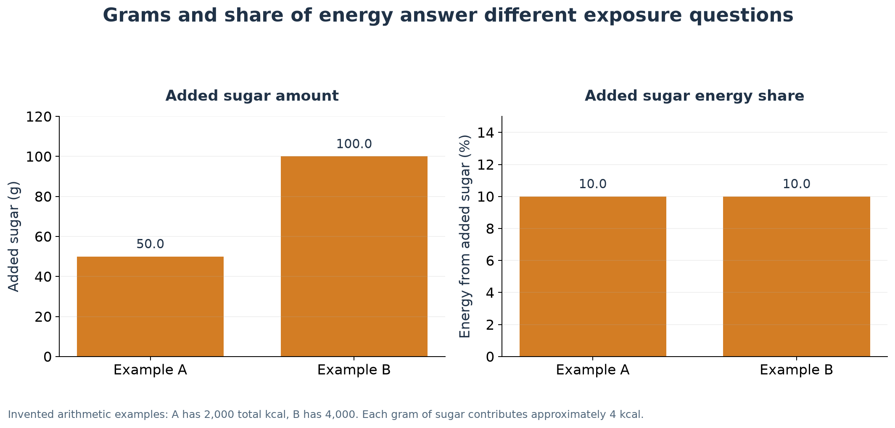

Invented arithmetic examples: A has 2,000 total kcal, B has 4,000. Each gram of sugar contributes approximately 4 kcal.

- 50 g / 2,000 kcal and 100 g / 4,000 kcal both give 10%.

Sources: Arithmetic illustration

**Teaching note:** Invented arithmetic examples, explicitly separate from study data. Students calculate both. Normalization changes the exposure question.
Invented arithmetic examples: A has 2,000 total kcal, B has 4,000. Each gram of sugar contributes approximately 4 kcal.

---

## Slide 42: Incomplete exhibit: only the extreme groups

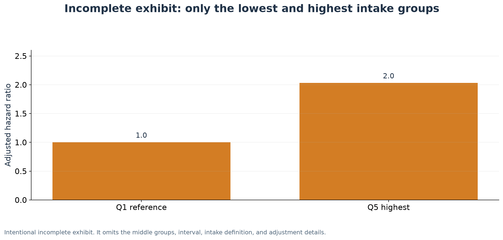

Intentional incomplete exhibit. It omits the middle groups, interval, intake definition, and adjustment details.

- A two-bar pitch hides intermediate groups and uncertainty.

Sources: [source 1](https://doi.org/10.1001/jamainternmed.2013.13563)

**Teaching note:** True published point estimates. Students identify the absent intake definition, confidence intervals, model and endpoint. Do not label this unadjusted.
Intentional incomplete exhibit. It omits the middle groups, interval, intake definition, and adjustment details.

---

## Slide 43: All five added-sugar groups

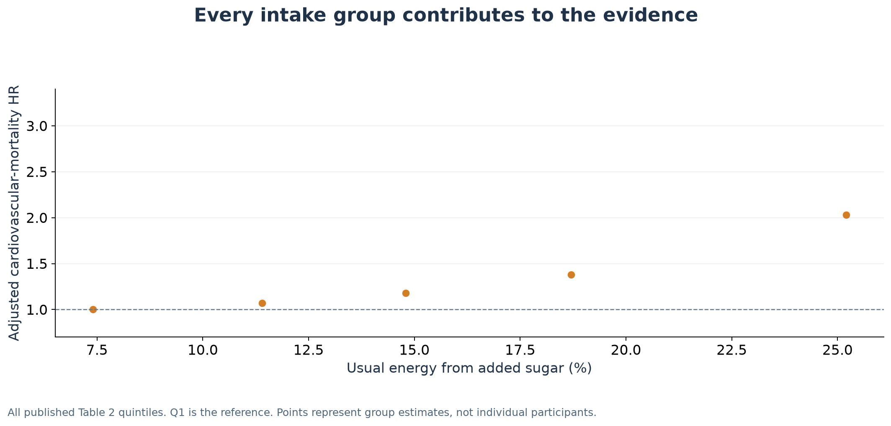

All published Table 2 quintiles. Q1 is the reference. Points represent group estimates, not individual participants.

- Every published quintile contributes a point at its midvalue.

Sources: [source 1](https://doi.org/10.1001/jamainternmed.2013.13563)

**Teaching note:** No interpolation, no individual-patient scatter, no invented dose-response curve. Q1 is the reference. Numeric positions preserve unequal exposure gaps.
All published Table 2 quintiles. Q1 is the reference. Points represent group estimates, not individual participants.

---

## Slide 44: The repaired sugar association

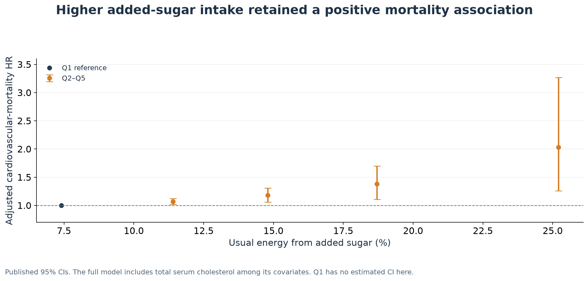

Published 95% CIs. The full model includes total serum cholesterol among its covariates. Q1 has no estimated CI here.

- Q5 vs Q1: adjusted mortality HR 2.03, 95% CI 1.26–3.27.

Sources: [source 1](https://doi.org/10.1001/jamainternmed.2013.13563)

**Teaching note:** The full model includes total serum cholesterol. Q1 is the reference with no interval estimated in this table. These are published model estimates, not recomputed effects from fabricated participants.
Published 95% CIs. The full model includes total serum cholesterol among its covariates. Q1 has no estimated CI here.

---

## Slide 45: The two published adjustment models

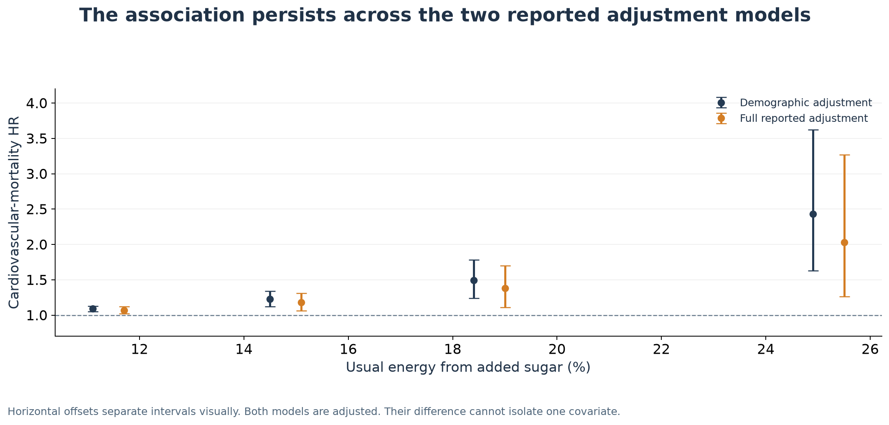

Horizontal offsets separate intervals visually. Both models are adjusted. Their difference cannot isolate one covariate.

- The positive association persists with the full adjustment.

Sources: [source 1](https://doi.org/10.1001/jamainternmed.2013.13563)

**Teaching note:** Demographic model adjusts age, sex and race/ethnicity. Full model additionally adjusts education, smoking, alcohol, activity, family CVD history, antihypertensive medication, diet quality, BMI, systolic BP, total cholesterol and total calories. Both models are adjusted. Horizontal offsets are visual separation, not changed exposures. Cannot attribute the model difference to cholesterol alone.
Horizontal offsets separate intervals visually. Both models are adjusted. Their difference cannot isolate one covariate.

---

## Slide 46: The sugar estimates on a logarithmic axis

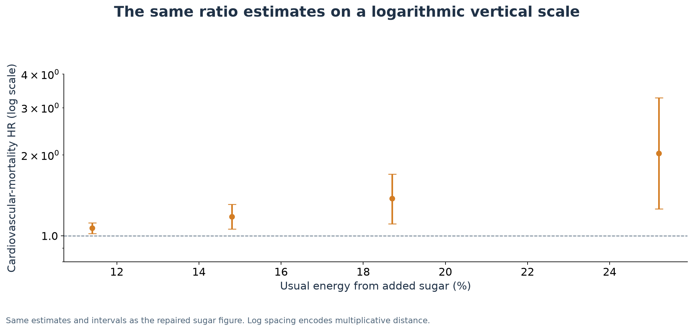

Same estimates and intervals as the repaired sugar figure. Log spacing encodes multiplicative distance.

- The data stay the same. Multiplicative spacing changes.

Sources: [source 1](https://doi.org/10.1001/jamainternmed.2013.13563)

**Teaching note:** Compare with the repaired linear-scale figure. Read the null of 1 and the asymmetric original-scale interval. Do not plot log values under a label saying hazard ratio without correctly back-transforming tick labels.
Same estimates and intervals as the repaired sugar figure. Log spacing encodes multiplicative distance.

---

## Slide 47: Hazard, cumulative risk, and the reported HR

`R(t) = P(T ≤ t)`

`h(t) = limΔt→0 P(t ≤ T < t+Δt | T ≥ t)/Δt`

`HR(t) = hE(t)/hR(t)`

- A hazard conditions on being event-free at time t.
- HR 2.03 does not specify an absolute mortality risk.

**Teaching note:** BOARD 9. Define T as event time. R(t) is a cumulative probability, h(t) an instantaneous conditional rate. The reported model interprets a relative hazard. Aggregate HR alone cannot give an empirical survival curve.

---

## Slide 48: Absolute risk also needs a baseline · optional extension

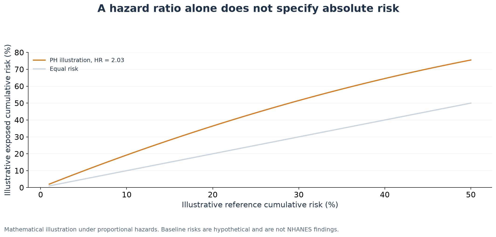

Mathematical illustration under proportional hazards. Baseline risks are hypothetical and are not NHANES findings.

- Under proportional hazards: R_E = 1 − (1 − R_ref)^HR.

Sources: [source 1](https://doi.org/10.1001/jamainternmed.2013.13563)

**Teaching note:** Reserve extension. S_E = S_ref^HR follows from cumulative hazards. R_ref is a hypothetical reference cumulative risk, not a risk ratio. Both risk curves here are illustrative, not empirical NHANES curves.

---

## Slide 49: The added-sugar finding

- Higher added-sugar intake retained a positive association with cardiovascular mortality.
- The full model includes total cholesterol. The association therefore survives that reported adjustment.
- The cohort does not identify the causal mechanism or prove that sugar replaces LDL as a contributor.

Sources: [source 1](https://doi.org/10.1001/jamainternmed.2013.13563)

**Teaching note:** Close Act 3. Adjustment is model-based, not a guarantee against residual confounding. Total cholesterol adjustment is not separate adjustment for LDL and HDL. The dataset answers whether an association remains in this model, not which biochemical pathway explains it.

---

## Slide 50: A figure specification before plotting

- Question: what comparison must the reader understand?
- Quantity: which units, endpoint, denominator, and time frame?
- Display: which position or length, scale, and reference?
- Evidence: which interval, source, and caption?

**Teaching note:** Students say these four lines before writing a plotting command. Use an evidence figure when reporting findings and a clearly labeled illustration when teaching a mathematical model.

---

## Slide 51: The evidence closes all three pitches

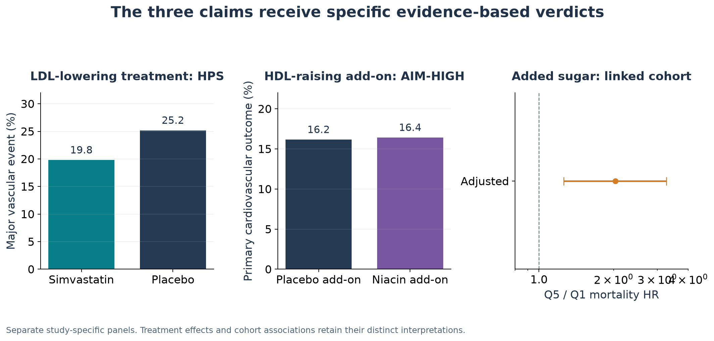

Separate study-specific panels. Treatment effects and cohort associations retain their distinct interpretations.

- Different designs and endpoints receive separate panels.

Sources: [source 1](https://doi.org/10.1016/S0140-6736(02)09327-3), [source 2](https://doi.org/10.1056/NEJMoa1107579), [source 3](https://doi.org/10.1001/jamainternmed.2013.13563)

**Teaching note:** This is the final evidence figure. Panels must not be pooled, ranked, or treated as one causal experiment. Restate each finding with its scope.
Separate study-specific panels. Treatment effects and cohort associations retain their distinct interpretations.

---

## Slide 52: The evidence workshop

- Choose one of the three incomplete pitches.
- Calculate one effect or exposure quantity from the supplied tables.
- Sketch a repaired chart and explain each change.
- Write three sentences that answer the editor’s question.

**Teaching note:** Minutes 155–175. Paper work is sufficient. 5 minutes calculation, 7 minutes figure and caption, 5 minutes defense, 3 minutes synthesis. Use STUDENT_WORKSHEET.md. Give no hints that erase the need to specify study design.

---

## Slide 53: The publication verdict

- LDL is a causal contributor. HPS demonstrates benefit from LDL-lowering treatment.
- Raising HDL with niacin did not demonstrate added patient benefit in AIM-HIGH.
- Higher added sugar retained an adjusted mortality association.
- “Sugar versus cholesterol” is a false choice.

Sources: [source 1](https://doi.org/10.1016/S0140-6736(02)09327-3), [source 2](https://pmc.ncbi.nlm.nih.gov/articles/PMC5837225/), [source 3](https://doi.org/10.1056/NEJMoa1107579), [source 4](https://doi.org/10.1001/jamainternmed.2013.13563)

**Teaching note:** Return to the initial three votes. The synthesis establishes multiple contributors and rejects biomarker-only treatment claims. It does not call all cholesterol bad, declare HDL harmful, or assert a proven causal sugar effect from this cohort.

---

## Slide 54: Exit ticket: a quantitative conclusion

- What does “54 fewer per 1,000” describe?
- Why can the HDL biomarker result and trial result coexist?
- What does the sugar model establish after total-cholesterol adjustment?
- Which chart repair most changed your first verdict?

**Teaching note:** Minutes 175–180. Require one numerical answer with endpoint/time frame and one explanation. Collect a four-sentence response. Next class can build on these analyst deliverables.

---

## Slide 55: Primary data sources

- HPS Collaborative Group, Lancet (2002)
- AIM-HIGH Investigators, NEJM (2011)
- Yang et al., JAMA Internal Medicine (2014)
- Source links and definitions are in data_dictionary.md.

Sources: [source 1](https://doi.org/10.1016/S0140-6736(02)09327-3), [source 2](https://doi.org/10.1056/NEJMoa1107579), [source 3](https://doi.org/10.1001/jamainternmed.2013.13563)

**Teaching note:** The notebook includes source URLs and verified aggregate tables. Local raw PDFs are verification copies and are excluded from the public package.

---

## Slide 56: Evidence synthesis and historical context

- Ference et al. (2017): converging evidence on LDL causality
- Kearns, Schmidt, and Glantz (2016): sugar-industry documents
- These sources support the broader conclusion and opening context.

Sources: [source 1](https://pmc.ncbi.nlm.nih.gov/articles/PMC5837225/), [source 2](https://pubmed.ncbi.nlm.nih.gov/27617709/)

**Teaching note:** Reference slide. Medical data analysis is educational and study-specific. This deck does not supply individualized treatment recommendations.
