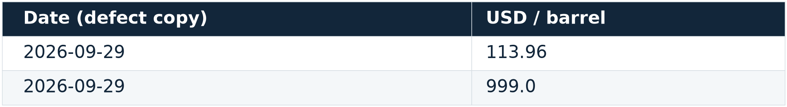
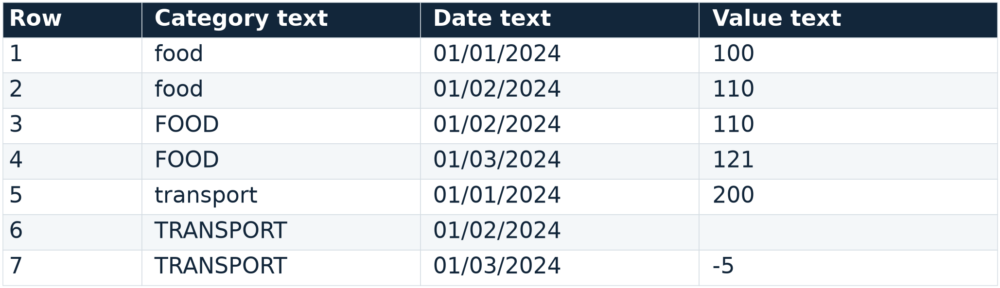
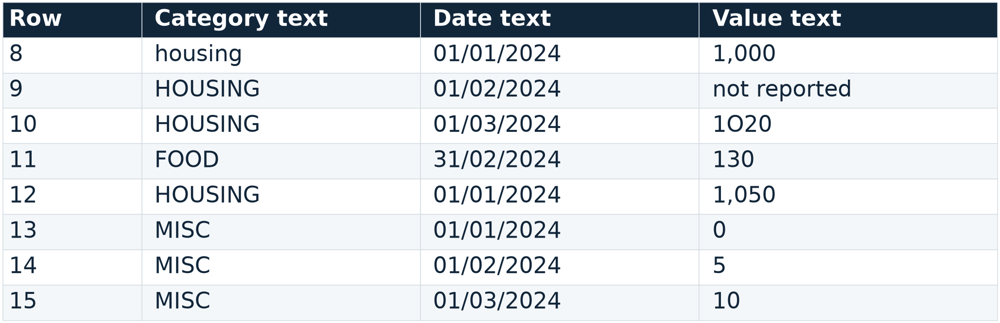
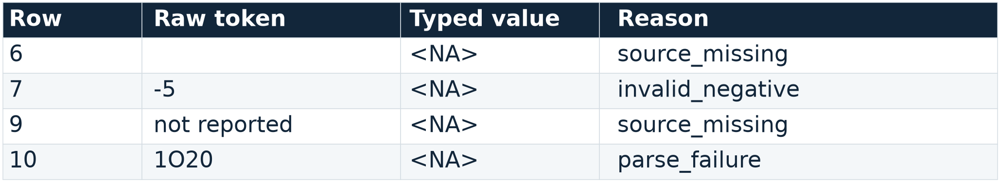
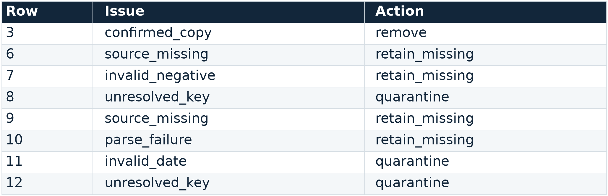
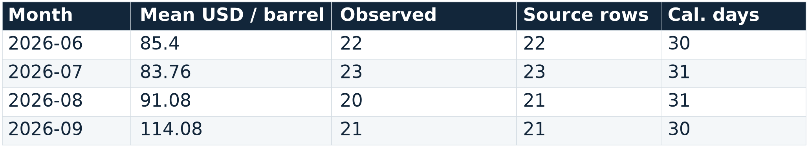
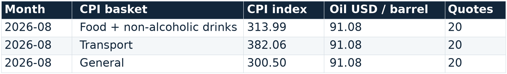
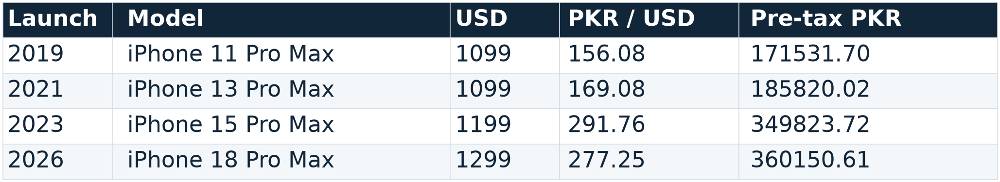
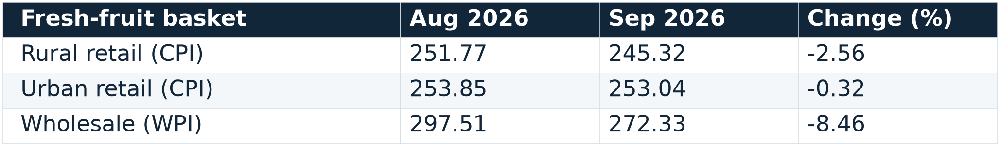

<!-- Slide number: 1 -->
FROM LECTURE 4 TO LECTURE 5
Reproducible pandas pipelines
We have downloaded the evidence.
How do we transform it into reliable results
without silently making it wrong?

→
→
1
2
3
Same evidence
Explicit contracts
Reliable results
1

<!-- Slide number: 2 -->
FROM LECTURE 4 TO LECTURE 5
Begin with the exact Lecture 4 evidence pack

→
→
→
1
2
3
4
L4 writes
the pack
L5 verifies
the manifest
Parse and
transform
Save outputs
+ decisions

No manual copying. No new download. No silent substitution.
Notebook cells 2–3 · a changed persisted input stops execution before analysis.
2

<!-- Slide number: 3 -->
FROM LECTURE 4 TO LECTURE 5
Write the transformation contract first
| Field | Contract for the real case |
| --- | --- |
| Grain | Brent: reported date → month; PBS: indicator × month |
| Keys | Unique raw date; unique oil month; unique PBS composite key |
| Units | USD / barrel and CPI index remain separate columns |
| Missingness | Missing quote ≠ malformed token ≠ invalid value; never zero-fill |
| Deliverables | Joined table, clean lab, quarantine, issue log and run record |
3

<!-- Slide number: 4 -->
INSPECT AND PARSE REAL EVIDENCE
Parse deliberately and keep the raw tokens

Three decisions
raw = pd.read_csv(path, dtype='string',
    keep_default_na=False)
missing = raw['DCOILBRENTEU'].eq('')
value = pd.to_numeric(
    raw['DCOILBRENTEU'].mask(missing),
    errors='coerce')
malformed = ~missing & value.isna()
Raw token retained.

Blank is missing.
Nonblank parse failure is a different event.
The source uses reported observation dates, not a complete daily calendar.
4

<!-- Slide number: 5 -->
INSPECT AND PARSE REAL EVIDENCE
Missing, malformed and invalid are different

Missing
Malformed
Invalid
No reported quote
Blank token → NA
Cannot parse as numeric
“1O20” → parse failure
Parsed but violates policy
−5 → invalid in this lab
One isna() result cannot explain why the value became missing. Synthetic zero remains observed.
5

<!-- Slide number: 6 -->
INSPECT AND PARSE REAL EVIDENCE
The denominator can silently change the answer

### Chart: Unknown is not $0 oil

| Category | March 2024 Brent mean |
|---|---|
| Observed quotes | 85.40850000000002 |
| Gaps filled with 0 | 55.10225806451613 |
State the denominator
20 observed quotes
21 source rows
31 calendar days

Weekends / closures are not zero prices.
Executed real-data example · reindexing is not permission to impute zeros.
6

<!-- Slide number: 7 -->
INSPECT AND PARSE REAL EVIDENCE
Audit real keys before injecting any defects

Defect copy only: same date, two values → quarantine both; the raw evidence remains unchanged.
7

<!-- Slide number: 8 -->
SYNTHETIC DATA-QUALITY LABORATORY
Controlled failure lab: raw records 1–7

Synthetic fixture · row 3 is a confirmed copy; blank and −5 need different policies.
8

<!-- Slide number: 9 -->
SYNTHETIC DATA-QUALITY LABORATORY
Controlled failure lab: raw records 8–15

Synthetic fixture · 1O20 is not 1020; 31/02/2024 is invalid; zero is an observed value.
9

<!-- Slide number: 10 -->
SYNTHETIC DATA-QUALITY LABORATORY
Normalize identifiers, not evidence away

Actual notebook display · parsed NA values retain different reason codes.
10

<!-- Slide number: 11 -->
SYNTHETIC DATA-QUALITY LABORATORY
Confirmed copies and key conflicts need policies

Confirmed repeated record
Unresolved analytical key
Rows 2 and 3:
FOOD, February, 110

Source note confirms row 3 is an accidental copy. Remove and log.
Rows 8 and 12:
HOUSING, January, 1000 / 1050

Quarantine both. Never average or keep first.
Invalid date row 11 is also quarantined; unknown values remain as missing-valued clean records.
11

<!-- Slide number: 12 -->
SYNTHETIC DATA-QUALITY LABORATORY
Account for every input record

### Chart: 15 = 11 + 3 + 1

| Category | Input disposition |
|---|---|
| Clean keys | 11.0 |
| Quarantined | 3.0 |
| Copy removed | 1.0 |
Clean ≠ all observed
11 clean keys
7 observed values
4 missing values

8 issue events explain the decisions.
Independent check: staged result == prepare_prices result; input unmutated.
12

<!-- Slide number: 13 -->
SYNTHETIC DATA-QUALITY LABORATORY
The issue log is part of the result

Actual notebook issue log · each saved event also includes a reason.
13

<!-- Slide number: 14 -->
COMBINE THE REAL DATA WITH CHECKS
concat stacks; merge relates

concat: compatible batches
merge: a key relationship
Same columns, units and meaning.
More observations, same grain.

Check schema and key overlap.
A reset index does not deduplicate.
Related tables, explicit join keys.
Potentially different grains.

Check cardinality, coverage and primary-row preservation.
14

<!-- Slide number: 15 -->
COMBINE THE REAL DATA WITH CHECKS
Daily oil must become monthly before the join

→
→
→
1
2
3
4
Brent
reported dates
groupby month
observed mean
One oil row
per month
Join PBS
series × month
Aggregation changes grain. Keep observed quote counts with the mean.
15

<!-- Slide number: 16 -->
COMBINE THE REAL DATA WITH CHECKS
An aggregation should carry its coverage

count = observed quotes; size = source rows; calendar days ≠ either · September is partial.
16

<!-- Slide number: 17 -->
COMBINE THE REAL DATA WITH CHECKS
Validate cardinality and expose match coverage

Predict first
joined = recent.merge(brent_monthly,
    on='period', how='left',
    validate='many_to_one', indicator=True)

assert len(joined) == len(recent)
assert joined['_merge'].eq('both').all()
3 series × 12 months
36 retained rows
0 unmatched

Keys, count and coverage are separate checks.
17

<!-- Slide number: 18 -->
COMBINE THE REAL DATA WITH CHECKS
The executed CPI–Brent join

Same month, separate units · CPI base 2015–16 = 100; Brent USD / barrel · alignment, not causality
18

<!-- Slide number: 19 -->
COMBINE THE REAL DATA WITH CHECKS
One duplicated month multiplies observations

Unchecked join
Validated join
Duplicate one right-side oil month.

36 primary rows become 39 rows.

The operation runs, but observation weights change.
validate="many_to_one"

MergeError: right keys not unique.

Fail visibly before a plausible summary hides the defect.
Predict the three extra rows before executing the labelled defect copy.
19

<!-- Slide number: 20 -->
COMBINE THE REAL DATA WITH CHECKS
Valid cardinality does not guarantee coverage

Cardinality passes
Coverage can fail
At most one oil record per month.

No row multiplication.

The relationship is structurally valid.
Restricted oil table: 2026 onward.

24 rows matched; 12 left_only.

Retain and report, reconcile, or explicitly fail.
indicator=True reveals unmatched rows. An inner join would silently change the cohort.
20

<!-- Slide number: 21 -->
SUMMARIZE AND RESHAPE WITHOUT LOSS
An index level becomes a rate by comparison

Index ≠ inflation
ordered = pbs.sort_values(['indicator', 'month'])
ordered['yoy_pct'] = (ordered
    .groupby('indicator')['index_2015_16_100']
    .pct_change(12, fill_method=None) * 100)

# YoY = 100 × (I_t / I_(t-12) - 1)
Denominator: same month one year earlier.

First 12 months: no YoY.

Monthly gaps require a calendar audit.
21

<!-- Slide number: 22 -->
SUMMARIZE AND RESHAPE WITHOUT LOSS
Aggregation and transform keep different grains

agg: group-level output
transform: row-level output
Daily Brent → one monthly mean.

Return the mean and observed count.

Output grain changes.
Annual mean broadcast to daily rows.

Daily deviation = quote − annual mean.

Original grain is retained.
22

<!-- Slide number: 23 -->
SUMMARIZE AND RESHAPE WITHOUT LOSS
Mean of means and pooled mean answer differently

Equal month weights
Equal quote weights
2024 mean of monthly means:
80.53 USD / barrel

Each month counts equally.

Board check: (70 + 100) / 2 = 85
2024 pooled observed mean:
80.52 USD / barrel

Each observed quote counts equally.

Board check: (3×70 + 2×100) / 5 = 82
Choose weights according to the question, not according to whichever result looks convenient.
23

<!-- Slide number: 24 -->
SUMMARIZE AND RESHAPE WITHOUT LOSS
pivot and melt change layout, not meaning

→
→
→
1
2
3
4
Long:
series × month
pivot:
12 × 3 cells
melt:
36 records
Check keys
and values
Unique cell keys are the contract; a reshape is not a reconciliation policy.
24

<!-- Slide number: 25 -->
SUMMARIZE AND RESHAPE WITHOUT LOSS
An ambiguous pivot cell is not an average

pivot: expose the ambiguity
pivot_table: implicit aggregation
One cell, two candidate values:
290.74 and 999.00

ValueError: duplicate cell keys.

Reconcile the evidence first.
Default mean: 644.87

A tidy-looking number that silently changes the evidence.

Use only a justified aggregation policy.
25

<!-- Slide number: 26 -->
PACKAGE REPRODUCIBLE DELIVERABLES
Package a policy, then independently validate it

Independent check
oil_monthly = (raw.pipe(tidy_brent)
                  .pipe(monthly_oil))

assert_frame_equal(oil_monthly, staged)
final = recent.merge(oil_monthly,
    on='period', how='left',
    validate='many_to_one', indicator=True)
Same raw inputs.
Same declared policies.
Staged == packaged result.

Re-check join preservation.
Small functions state contracts; validate against the staged computation, not just “it ran”.
26

<!-- Slide number: 27 -->
PACKAGE REPRODUCIBLE DELIVERABLES
Reproducibility needs more than a CSV
| Artifact | What another person can inspect |
| --- | --- |
| lab\_clean\_prices.csv | Unique keys; observed and missing values with reasons |
| lab\_quarantine.csv + lab\_issues.csv | Rejected candidates and explicit decisions |
| cpi\_brent\_monthly.csv | 36-row real join with declared monthly grain |
| run\_record.json | Versions, persisted input path and accounting |
| Slide asset manifest + build sources | Notebook cells, hashes and reproducible slide assets |
27

<!-- Slide number: 28 -->
RETURN TO THE MOTIVATING QUESTION
Recompute the iPhone benchmark

Recomputed benchmark: +110.0% since 2019 · pre-tax arithmetic, not Pakistan retail prices
28

<!-- Slide number: 29 -->
RETURN TO THE MOTIVATING QUESTION
Fresh-fruit change is not apple inflation

CPI / WPI fresh-fruit baskets are NOT apple-specific retail prices; monthly change ≠ YoY change.
29

<!-- Slide number: 30 -->
RETURN TO THE MOTIVATING QUESTION
Aligned months do not identify a causal effect

### Chart: Three CPI baskets in matched months

| Category | Food + drinks | General | Transport |
|---|---|---|---|
| 2025-09 | 290.74 | 276.01 | 317.05 |
| 2025-10 | 298.58 | 280.66 | 319.76 |
| 2025-11 | 297.9 | 281.78 | 320.24 |
| 2025-12 | 291.47 | 280.53 | 320.05 |
| 2026-01 | 291.6335102956167 | 281.6183050369451 | 315.65288851754593 |
| 2026-02 | 289.14034454638124 | 282.38620099836425 | 309.69296013368347 |
| 2026-03 | 288.2238209989806 | 285.72761295053306 | 346.1341752208164 |
| 2026-04 | 293.409975127421 | 292.8060801511648 | 399.6950656481261 |
| 2026-05 | 293.7071200815494 | 294.3417001804952 | 420.1949558367152 |
| 2026-06 | 296.52108460754334 | 293.471797760731 | 389.8712270231559 |
| 2026-07 | 308.8558874617737 | 296.9713518810988 | 369.4538672714252 |
| 2026-08 | 313.9900440366972 | 300.49612668509224 | 382.0613368345668 |
Describe, do not attribute
The join aligns observations.

It does not estimate oil pass-through or apple-specific costs.
Validated join · September 2025–August 2026 · shared timing is not a counterfactual.
30

<!-- Slide number: 31 -->
RETURN TO THE MOTIVATING QUESTION
Keep the oil benchmark on its own scale

### Chart: Brent across the same matched months

| Category | Monthly Brent mean |
|---|---|
| 2025-09 | 67.98545454545454 |
| 2025-10 | 64.54347826086956 |
| 2025-11 | 63.797 |
| 2025-12 | 62.54428571428572 |
| 2026-01 | 66.60238095238095 |
| 2026-02 | 70.887 |
| 2026-03 | 103.13454545454546 |
| 2026-04 | 117.2875 |
| 2026-05 | 107.13947368421051 |
| 2026-06 | 85.3990909090909 |
| 2026-07 | 83.75869565217391 |
| 2026-08 | 91.076 |
A separate measurement
Observed-quote monthly mean.

No zero prices for weekends / closures.

No causal share is estimated.
A benchmark crude series is not a Pakistan fuel-price series.
31

<!-- Slide number: 32 -->
EXIT CHECK
Defend the operation, policy and pass condition

→
→
→
1
2
3
4
Name the
grain
State the
policy
Predict the
result
Check the
invariant
Reliable results preserve the meaning of their evidence.
32
